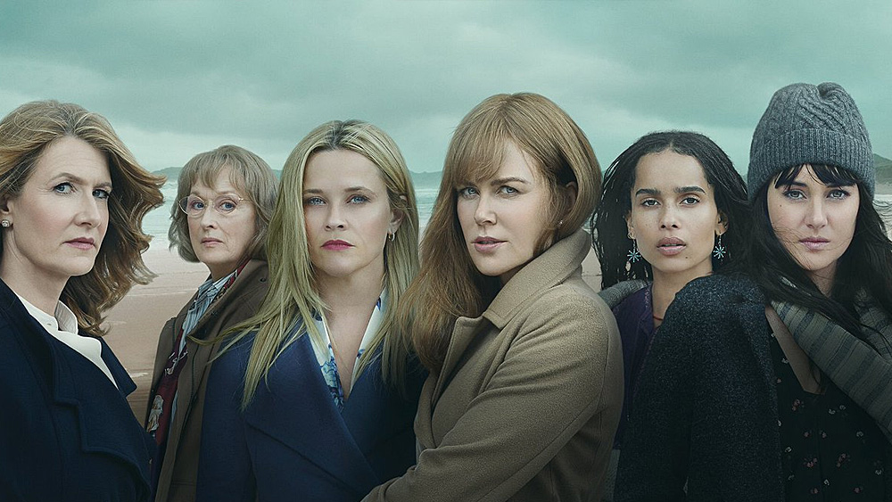
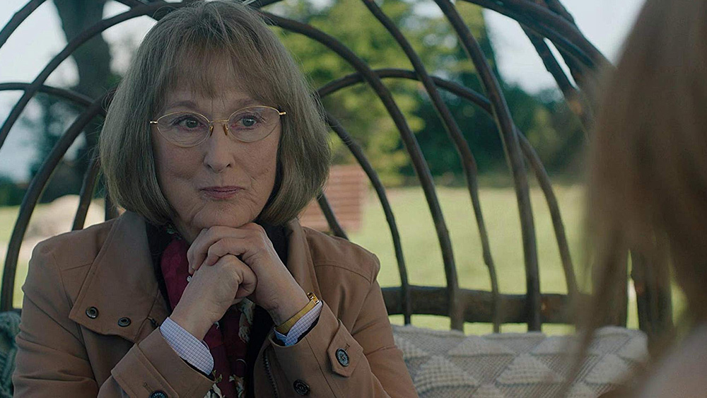
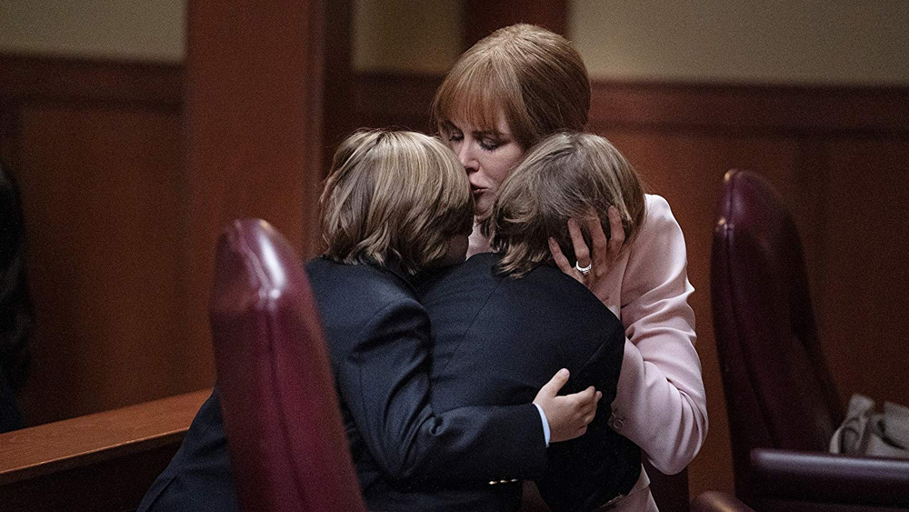
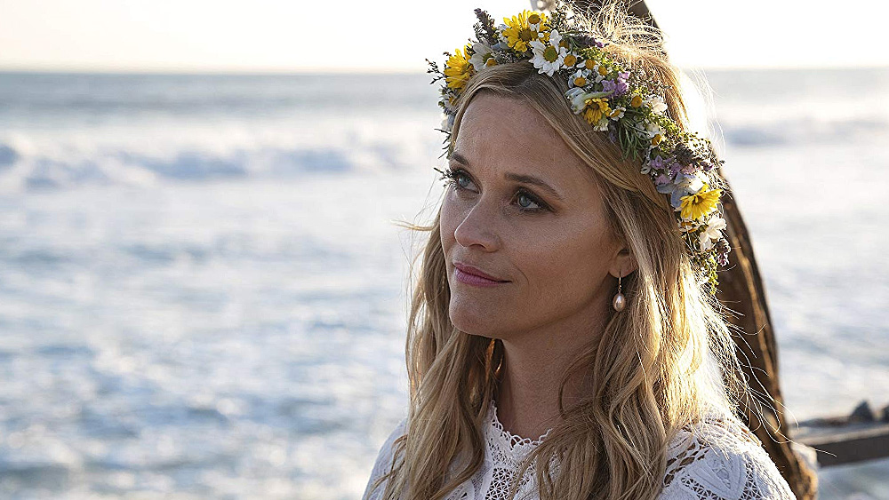
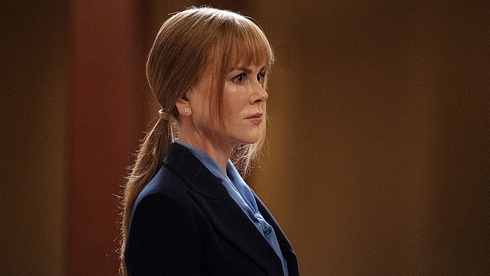

Po sukcesie pierwszego sezonu serialu [Big Little Lies](https://www.imdb.com/title/tt3920596/), kontynuacja opowieści była tylko kwestią czasu. Stacja, [HBO](./tag/hbo) na fali sukcesu, chciała po raz kolejny wykorzystać kurę znoszącę złote jajka. I generalnie nie ma w tym nic złego, gdyby nie fakt, iż w przypadku drugiego sezonu zawiodło sporo elementów, które stanowiły o jakości tego serialu.

Ale przyczyna tego stanu rzeczy nie jest tak prosta, jak mogłoby się początkowo wydawać - do tego jednak wrócimy.

Historia opowiedziana w kontynuacji Big Little Lies bezpośrednio kontynuuje wątki zapoczątkowane w pierwszym sezonie, przenosząc akcję kilka miesięcy do przodu od feralnej nocy, która na stałe połączyła losy sławetnej piątki z Monterey. I pierwsze pytanie, jakie nasuwa się widzowi - tak właściwie, to po co?

Nie zrozumcie mnie źle - pod względem scenariusza pierwszy sezon był rozpisany naprawdę na wysokim poziomie, przedstawiając widzom historię, która mogła zostać zamknięta - dając pole do własnych interpretacji, zostawiając nas w lekkim zawieszeniu. I nie byłoby w tym nic złego. Tym bardziej, że oryginalnie Big Little Lies miał być pełnometrażowym filmem.

HBO zgodziła się jednak na kontynuowanie wątków, już na starcie popełniając naprawdę poważny błąd - przekazując reżyserię drugiego sezonu zupełnie nowej osobie - [Andrea Arnold](https://www.imdb.com/name/nm0036349/). Dotychczasowy showrunner Big Little Lies, [Jean-Marc Vallée](https://www.imdb.com/name/nm0885249/), był bowiem w tym czasie zajęty pracą nad innym projektem stacji - [Sharp Objects](https://www.imdb.com/title/tt2649356/).

Andrea wzięła się do pracy... **i stworzyła serial, który klimatem w ogóle nie przypominał konwencji tak pieczołowicie wykreowanej w pierwszym sezonie**. Pojawił się poważny problem - skutkiem czego [David E. Kelley](https://www.imdb.com/name/nm0005082/) (twórca serialu) wraz ze stacją HBO, odebrali reżyserce całkowicie kontrolę nad stworzonymi odcinkami, przekazując je do ponownego montażu w ręce Jean-Marc Vallée.

Rozpoczął się proces, nad którym w pewnym momencie pracowało 11 (sic!) osób - skutkiem czego praca reżyserki została rozbita na części pierwsze, a poszczególne odcinki skrócone o nawet 30 minut. To musiało odbić się echem na całokształcie produkcji.

I tak się niestety stało - **proces budowania postaci i ich wzajemnych relacji został ogromnie spłycony względem oryginalnych konceptów**, jakie zaproponowała Andrea. Ucierpiał też sam scenariusz, w którym w wielu naprawdę istotnych momentach pojawiło się sporo luk fabularnych, które potem są wypełniane z nienacka. Zostawiając tym samym widzów z lekkim niedowierzaniem na twarzy, bo jak, bo skąd to się nagle wzięło?

Byłoby jednak znacznym nadużyciem stwierdzenie, że pod względem scenariusza drugi sezon Big Little Lies jest słaby - nie jest. **Znajdziemy tu kilka naprawdę angażujących wątków**. Może nie tyle i nie w takiej jakości, jak w sezonie pierwszym, ale są to nadal tematy, które potrafią trzymać widza przy sobie - próba powrotu do codzienności przez Celeste, historia Renaty, czy też naprawdę satysfakcjonujący wątek Mary Louise.

Nie mogłem się jednak oprzeć wrażeniu, że scenarzysta zbyt bardzo oderwał się od rdzenia opowieści, która de facto zakończona została wraz z pierwszym sezonem, przez co tworzone tutaj historie, mimo że bywają ciekawe, są po prostu momentami dodane na siłę.

To, co jednak stanowi o wyjątkowej jakości tego serialu, to bezsprzecznie obsada aktorska. Do znanych nam już wcześniej [Reese Witherspoon](https://www.imdb.com/name/nm0000702/) (Madeline), [Nicole Kidman](https://www.imdb.com/name/nm0000173/) (Celeste), [Shailene Woodley](https://www.imdb.com/name/nm0940362/) (Jane), [Zoë Kravitz](https://www.imdb.com/name/nm2368789/) (Bonnie) i [Laura Dern](https://www.imdb.com/name/nm0000368/) (Renata) dołącza również [Meryl Streep](https://www.imdb.com/name/nm0000658/) (Mary Louise Wright), która bez ogródek po prostu kradnie swoją kreacją ogromną część tego sezonu - wykreowana przez nią postać cechuje się ze wszech miast niesamowitym wręcz warsztatem - zapewniam, to postać, która zapadnie Wam w pamięć.

Ale oryginalna piątka z Monterey wcale nie ustępuje starszej wiekiem i bardziej doświadczonej koleżance. Już pierwszy sezon stworzył solidne podstawy pod kreowane przez nich postaci, drugi pod tym względem doskonale je uzupełnia, a panie dają z siebie wszystko, by stworzyć naturalne, pełne krwi i kości role.

Ciężko mi jednoznacznie podsumować drugi sezon Big Little Lies - bo **z jednej strony jest naprawdę zbędny, znacznie skrócony i pełen luk fabularnych** niezwykle istotnych dla prowadzonych wątków. Z drugiej jednak **to ciągle serial stworzony na wysokim poziomie** - potrafi wciągnąć, bawi i angażuje emocjonalnie, do tego jest rewelacyjnie zagrany.

Innymi słowy - **dobry! Ale nie róbcie więcej**...