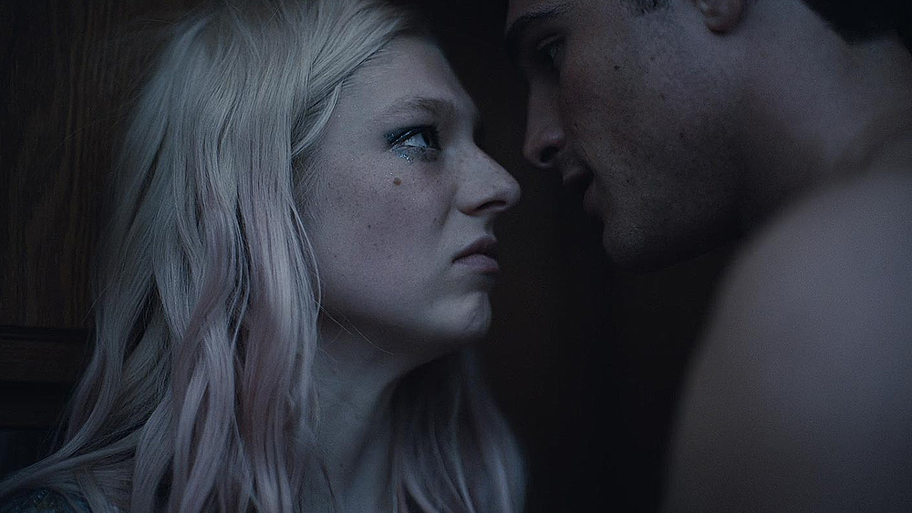

Po rewelacyjnym [Chernobyl](https://www.imdb.com/title/tt7366338/) stacja HBO znowu na topie, serwując widzom [Euphoria](https://www.imdb.com/title/tt8772296/) - świetny dramat, który zagrał na wielu płaszczyznach, stając się z miejsca jednym z większych zaskoczeń tegorocznej, letniej ramówki.

Twórca serii, [Sam Levinson](https://www.imdb.com/name/nm0506094/), nie ma może w swoim dorobku produkcji wybitnych (The Wizard of Lies, Assassination Nation), ale nie przeszkodziło mu to w wykreowaniu **dopracowanej, dojrzałej i smutnej opowieści, którą od pierwszych minut serialu ogląda się z rosnącym zaciekawieniem**. I niech Was nie zmylą materiały promocyjne, z teen drama Euphoria ma niewiele wspólnego - to historia pełna osobistych porażek, tragedii i trudnych moralnie wyborów.

Mimo, że teoretycznie główną bohaterką Euphoria jest Rue, to serial ten nie gloryfikuje tej konkretnej postaci (zresztą świetnie wykreowanej przez [Zendaya](https://www.imdb.com/name/nm3918035/)), zamiast tego buduje ciekawe pod względem fabularnym wątki dotyczące wszystkich głównych bohaterów przewiających się przez serial. Spychając często Rue jedynie do roli narratorki, dzięki której poznajemy otaczający ją świat.

O ile taki zabieg może być często niebezpieczny, to w przypadku tego serialu sprawdził się bardzo dobrze - **za sprawą świetnie rozpisanych postaci pierwszo i drugoplanowych, z których każda walczy z własnymi demonami i każda bez wyjątku niesie za sobą kawał angażującej historii**.

> If I could be a different person, I promise you, I would. Not because I want it, but because they do. And therein lies the catch.
> 
> -- <cite>Rue</cite>

Początkowo nakreślony wątek uzależnienia i odwyku Rue schodzi szybko na dalszy plan, koncentrując się na problemach i codziennych rozterkach młodzieży żyjącej w świecie pełnym alkoholu, ostrych narkotyków, imprez i seksu. To miejsce, w którym każda z tych postaci nie tylko walczy o mały kawałek szczęścia, ale i moment, w którym decydują one o własnej przyszłości.

## To jest po prostu dobrze zagrane

Scenariusz to z pewnością jedna z najsilniejszych stron Euphoria. Ale sama historia nie czyni serialu automatycznie dobrym - na uwagę z pewnością zasługuje gra aktorska młodego pokolenia - wspomniana już **Zendaya zagrała najlepszą w swojej dotychczasowej karierze rolę**, dając niesamowity wręcz popis umiejętości aktorskich, co jest sporym zaskoczeniem biorąc pod uwagę fakt, iż jest to gwiazda wykreowana przez Disney'a.

Ale Zendaya miała po części ułatwioną pracę, występując w gronie naprawdę utalentowanych aktorów - [Hunter Schafer](https://www.imdb.com/name/nm9476408/) (Jules), [Barbie Ferreira](https://www.imdb.com/name/nm9209960/) (Kat), [Jacob Elordi](https://www.imdb.com/name/nm8624059/) (Nate), [Angus Cloud](https://www.imdb.com/name/nm3783307/) (Fezco), czy też [Alexa Demie](https://www.imdb.com/name/nm7051533/) (Maddy) nie ustępują poziomem, tworząc tym samym naprawdę różnorodne i barwne postaci.

## Wygląda obłędnie...

Nie będzie przesadą, jeśli stwierdzę, że **Euphoria cechuje się jednymi z najpiękniejszych kadrów występujących w serialach telewizyjnych** - operator niesamowicie wykorzystuje światło otoczenia, ogniskową obiektywu, kąt kamery, czy też jej ruch, by przedstawić widzom niektóre z ujęć. Postprodukcja dokłada swoje, skutkiem czego efekt tego jest momentami oszałamiający.

Euphoria to wizualna uczta zrobiona z ogromnym wyczuciem estetyki - ogląda się to z ogromną przyjemnością.

## I świetnie brzmi!

Głównym kompozytorem ścieżki dźwiękowej do Euphoria jest [Timothy Lee McKenzie](https://en.wikipedia.org/wiki/Labrinth) - znany lepiej pod scenicznym pseudonimem Labirynth - ten brytyjski piosenkarz, raper i kompozytor stworzył niezwykle spójną i przejmującą ścieżkę dźwiękową, która idealnie współgra z obrazem oraz samym klimatem serialu. To bardzo mocna strona Euphorii i szereg naprawdę dźwięcznych utworów, które nie tylko zapadają w pamięć, ale też dobrze 'wchodzą' słuchane niezależnie od samego serialu.

## Warto!

(...) zanurzyć się w klimat świata wykreowanego przez twórców i przez chwilę żyć problemami kilku młodych, chociaż nie tylko, ludzi. Bo Euphoria jest na swój sposób wyjątkowa. Gorąco polecam.