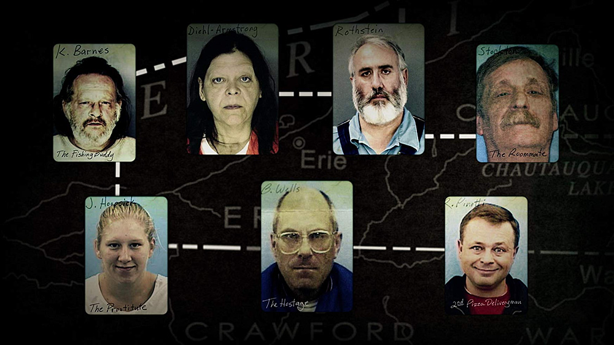
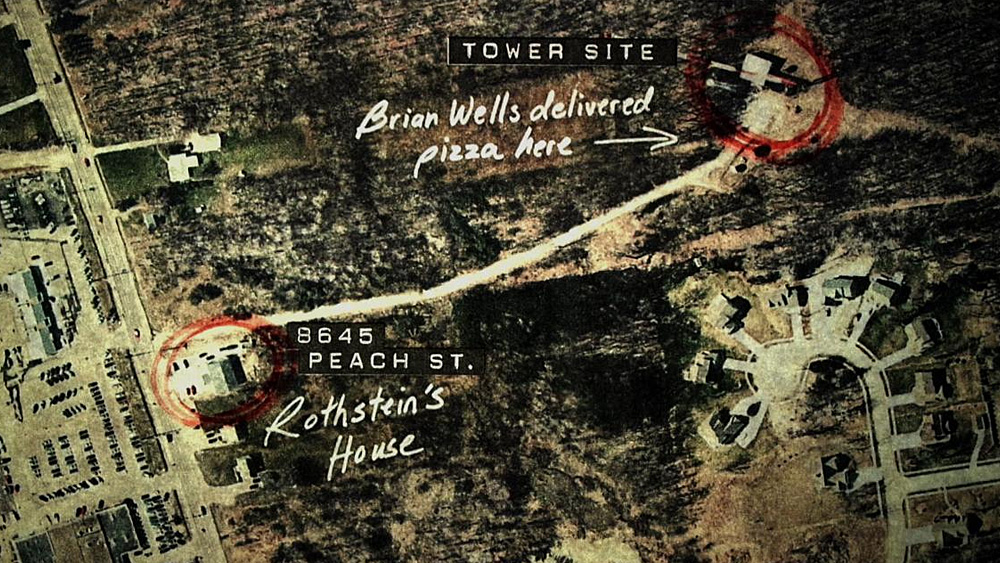
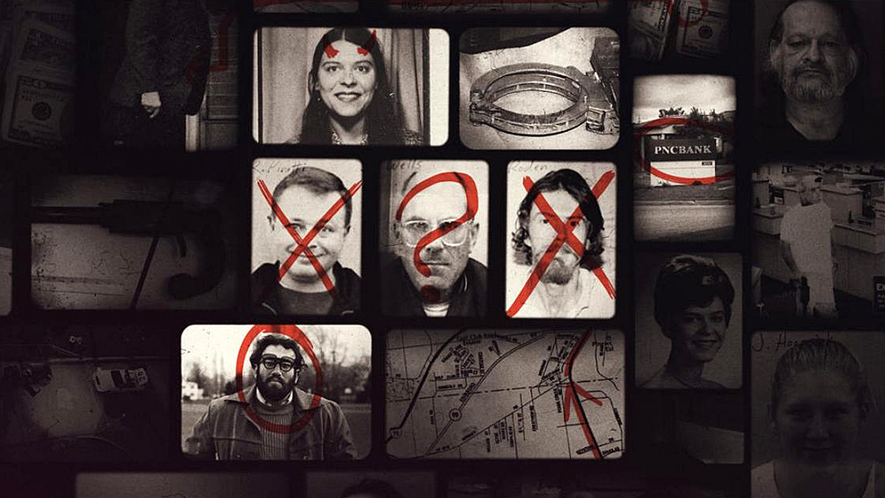

14:28, 28 sierpnia 2003 roku. Do siedziby PNC Bank wchodzi mężczyzna z bombą przyczepioną do karku, żądając 250.000 dolarów amerykańskich. To prawdziwa historia, jednego z najbardziej nieludzkich napadów na bank.

Zarezerwujcie sobie wolne 3 godziny, bo [Evil Genius: The True Story of America’s Most Diabolical Bank Heist](https://www.imdb.com/title/tt8342862/) to kawał dobrego dokumentu.

Netflix przyzwyczaił widzów do naprawdę wysokiego poziomu kręconych przez stację seriali dokumentalnych, szczególnie tych poruszających wątki szeroko pojęte, jako kryminalne – żeby daleko nie szukać: [Making a Murderer](https://www.imdb.com/title/tt5189670/), [The Keepers](https://www.imdb.com/title/tt6792200/), czy też [Amanda Knox](https://www.imdb.com/title/tt5952332/) – to tylko kilka wybranych przeze mnie propozycji, które zdecydowanie warto zobaczyć. Evil Genius: The True Story of America’s Most Diabolical Bank Heist dołącza bezsprzecznie do tego grona.

## 911, what’s your emergency? We’ve just been robbed

28 sierpnia 2003 roku, Brian Douglas Wells wchodzi do siedziby PNC Bank z bombą przywieszoną do szyi, żądając wydania 250.000 tysięcy dolarów. **To wydarzenie daje początek sprawie kryminalnej, z jaką FBI, ATF oraz lokalna policja spotykają się pierwszy raz w historii Stanów Zjednoczonych**. Niekonwencjonalny napad na bank kryje za sobą pełne cholernie interesujących wątków i splotów akcji wydarzenia, których nie powstydziłby się dobry film kryminalny.

Ale wydarzenia, którym początek dał brawurowy napad w wykonaniu Briana Wellsa to tak naprawdę historia Marjorie Diehl-Armstrong, niewyobrażalnie inteligentnej kobiety, która cóż, daleka była od tego, co tradycyjnie określamy mianem osoby normalnej.

## The Heist

Osoby odpowiedzialne za stworzenie Evil Genius: The True Story of America’s Most Diabolical Bank Heist pochwalić trzeba przede wszystkim za ilość pracy włożoną w produkcję tego czteroodcinkowego dokumentu – wszelkie potrzebne informacje zbierane były latami, skrupulatnie analizowane przez śledczych, co finalnie przełożyło się na przedstawienie kompletnej historii wspomnianej wyżej Marjorie.

## The Frozen Body

Zagrało tu wszystko, chociaż część osób z pewnością stwierdzi, że wykorzystany został po prostu dobry temat – owszem, to prawda, bo przedstawiona tutaj historia jest niezwykle angażująca, ogromnie interesująca i czasami aż niewyobrażalnie niewiarygodna. Ilość wątków i dziwnych splotów okoliczności podsycają dodatkowo zainteresowanie widzów. Temat naprawdę jet wyjątkowo ciekawy, chociaż sam zarys fabularny może sugerować zwykłą, niczym nie wyróżniającą się historię kryminalną.

## The Suspects

Evil Genius: The True Story of America’s Most Diabolical Bank Heist ogląda się jednym tchem – i nie ma w tym odrobiny przesady – cały dokument obejrzałem przy jednym posiedzeniu, ani razu nie czując przy tym chwili znużenia – oprócz dobrej historii ważny jest bowiem montaż, dobrze przedstawiona chronologia wydarzeń, czy też interesujący sposób narracji, za który opowiada zarówno główny dziennikarz śledczy, jak i osoby biorące udział w śledztwie dotyczącym tego, co pierwotnie miało być zwykłym napadem na bank.

## The Confessions

**Evil Genius to kolejna perełka wśród oferowanych przez Netflix oryginalnych seriali dokumentalnych**, ale na wypadkową finalnych wrażeń składa się kilka pomniejszych elementów – świetnie wybrana historia, naprawdę starannie przeprowadzone śledztwo, umiejętne prowadzenie akcji i dozowanie napięcia.

To serial, który będzie Was trzymał przy sobie przez każdą kolejną minutę. To też kolejny wręcz wzorcowy przykład, jak przeoczenie jednej, z pozoru nieistotnej wydawałoby się rzeczy, może przeciągnąć i tak trudne śledztwo o kolejnych kilka lat. Przedstawione tu wydarzenia rozegrały się naprawdę, aż dziw że wszystko jest pełne tylu nieoczekiwanych zwrotów akcji.