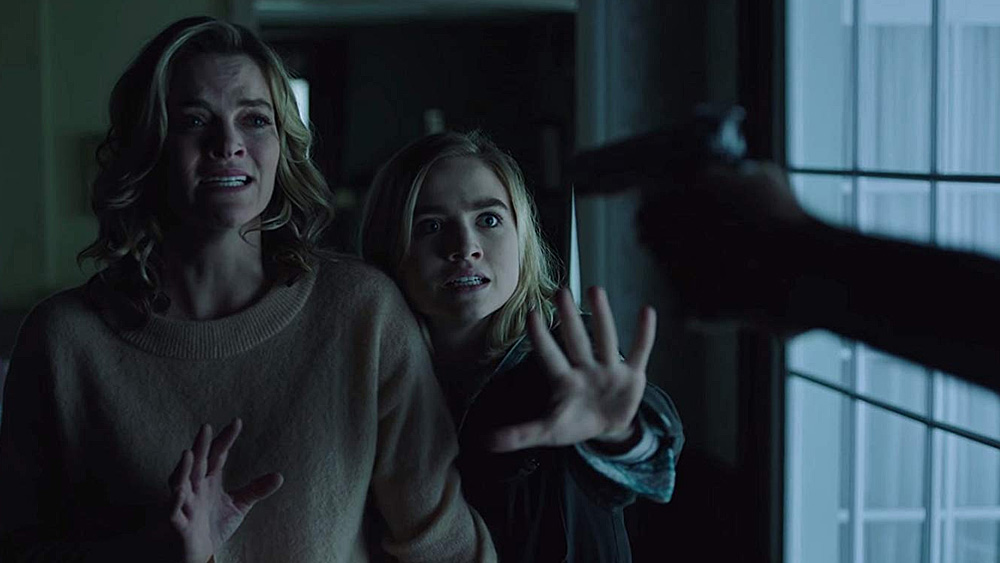
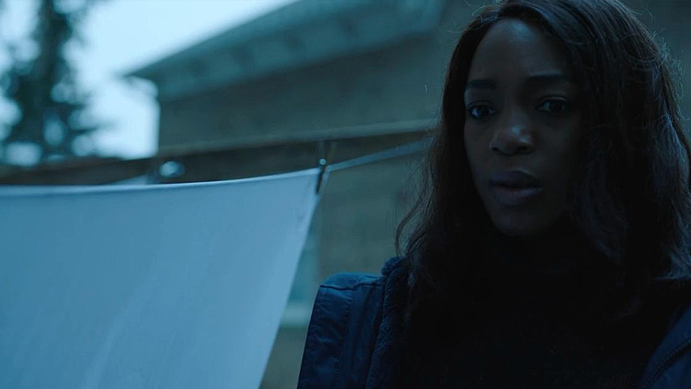
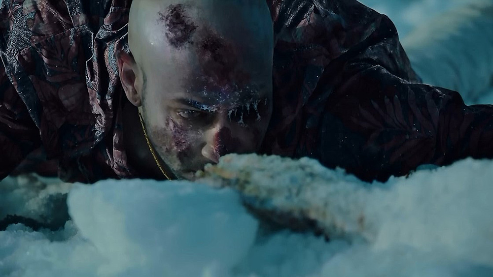
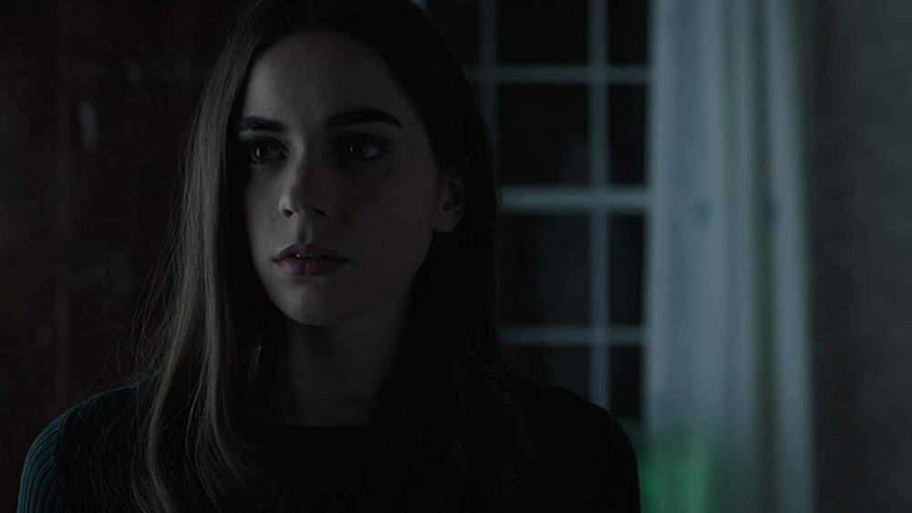

[Impulse](https://www.imdb.com/title/tt6160506/) to składający się z 10 epizodów, amerykański dramat science-fiction luźno oparty na tytułowej powieści autorstwa Stevena Goulda, trzeciej w kolejności książce wchodzącej w skład uniwersum zapoczątkowanego przez wydaną w 1992 roku powieść Jumper ([w 2008 powstała ekranizacja tej powieści](https://www.imdb.com/title/tt0489099/), którą z pewnością fani gatunku mieli okazję obejrzeć, chociaż film sam w sobie był dość przeciętny).

Motywem przewodnim zaprezentowanej przez scenarzystów historii są losy 16. letniej Henrietty (Henry), która w trakcie traumatycznego dla siebie przeżycia odkrywa w sobie zdolność do teleportacji. Temat wydawałoby się więcej mający wspólnego z szeroko pojętym kinem science-fiction, niż z dramatem, ale poniższą recenzją postaram się udowodnić, że **Impulse to przede wszystkim dobry, trzymający w napięciu dramat**.

Historia przedstawiona w Impulse budowana jest co prawda dość powoli i wbrew pozorom teleportacja sama w sobie nie jest motywem przewodnim opowiadanej tutaj historii. Stanowi jednakowoż tło wydarzeń, w których uczestniczy Henry oraz jej bliscy. Sam klimat opowieści jest też o wiele cięższy, niż początkowo można by wnioskować po ogólnej tematyce serialu. **Fabuła bowiem koncentruje się na ważnym z psychologicznego punktu widzenia aspekcie – napaści seksualnej i konsekwencji tejże**.

## I’m going to tell everyone what you are!

To, co bezsprzecznie wyróżnia serial w swoim gatunku, to ciekawie i sprawnie poprowadzona historia, za której stworzenie odpowiada [Jeffrey Lieber](https://www.imdb.com/name/nm0509340/), scenarzysta takich produkcji, jak Lost, The Originals, Lucifer, czy też NCIS: Nowy Orlean. Uprzedzając w tym miejscu – to historia niewiele mająca wspólnego z książkowym oryginałem, aczkolwiek korzystająca z bazy przedstawionych tam zarysów świata.

Zdecydowanie warto wspomnieć również o producencie wykonawczym – [David Bartis](https://www.imdb.com/name/nm1378004/) (odpowiedzialny między innymi za [Edge of Tomorrow](https://www.imdb.com/title/tt1631867/), czy też [Captive](https://www.imdb.com/title/tt6246500/)) umiejętnie obrazuje przygotowaną przez scenarzystę historię.

Dobra i wiarygodna linia fabularna uzupełniana jest przez wyjątkowo ciekawe kreacje postaci – uznanie należy się przede wszystkim [Maddie Hasson](https://www.imdb.com/name/nm4487976/), która wcieliła się w rolę głównej bohaterki i wykreowała tym samym prawdziwą postać z krwi i kości. Postać, która z pewnością wielokrotnie Was zaskoczy swoją autentycznością.

Ale Maddie, o ile faktycznie stanowi o sile serialu i wpływa na finalny jego odbiór, uzupełniana jest przez szereg postaci drugoplanowych, które wsparte zostały równie ciekawymi wątkami fabularnymi i świetnie potrafią odnaleźć się w tworzonych przez siebie kreacjach – [Sarah Dejardins](https://www.imdb.com/name/nm4480988/) (Jenna Hope), [Tanner Stine](https://www.imdb.com/name/nm6003345/) (Clay Boone), czy też [David James Elliott](https://www.imdb.com/name/nm0004895/) (Bill Boone) to postaci, które niejednokrotnie potrafią skraść spory fragment danego epizodu.

## No one is going to believe you.

A wraz z każdym kolejnym sytuacja robi się coraz bardziej ciekawsza, scenarzysta umiejętnie trzyma widzów w napięciu, dawkując informacje i subtelnie popychając newralgiczne wątki do przodu. Pozornie wolne początkowe tempo nabiera rozpędu wyjątkowo dynamicznie. I o ile zdarzają się wolniejsze momenty, dające widzom chwilę wytchnienia, to jednak **serial Impulse idzie świetnie wytyczonym fabularnie rytmem**, który przede wszystkim zadowoli zwolenników dobrze prowadzonych historii dramatycznych.

Nie ma tutaj bowiem dobrego zakończenia, klarownych sytuacji, ulgi oraz podanych na tacy rozwiązań. Pozostaje wiele otwartych kwestii, jakie mam nadzieję przyjdzie nam, wraz z bohaterami, rozwiązać w kolejnym, drugim sezonie Impulse.

## You can’t control, what you don’t understand!

To jeszcze nie wszystko, bowiem całości dopełnia świetnie zrealizowana ścieżka dźwiękowa, za stworzenie której odpowiada [Benjamin Wynn](https://www.imdb.com/name/nm4047163/). Kawał dobrej roboty i przy tym naturalne uzupełnienie serialu.

Impulse może nie jest serialem idealnym, ma kilka pomniejszych wad, ale te 10 epizodów wywarło na mnie niezwykle pozytywny wpływ i na tyle zaabsorbowało, że chętnie, zresztą nie tylko ja, poznam dalszą część historii. Warto.