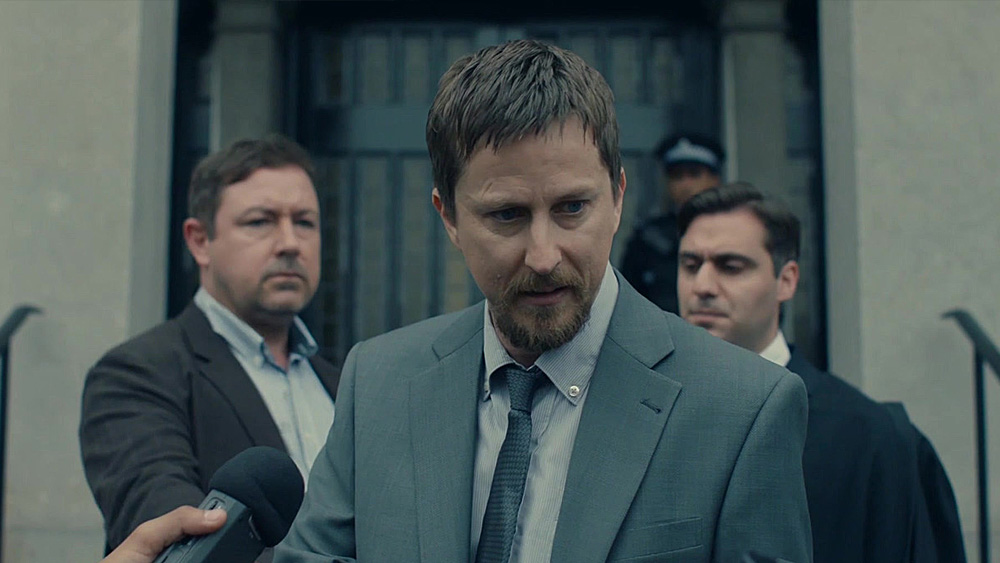
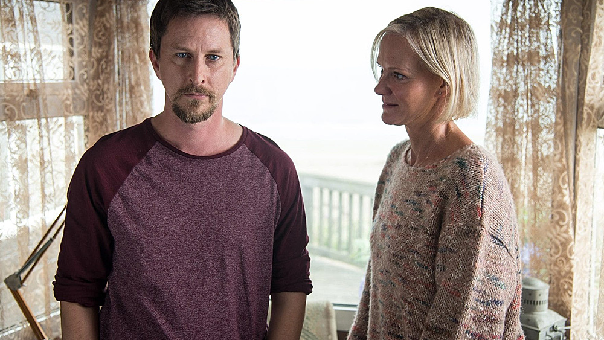

[Innocent](https://www.imdb.com/title/tt5963958/) to wyprodukowana przez Sundance Now czteroodcinkowa mini seria łącząca w sobie elementy dramatu oraz serialu kryminalnego – produkcja utwierdzająca w przekonaniu, że Brytyjczycy, to obok nacji Skandynawskich, kolejni specjaliści w tworzeniu oryginalnych, trzymających w napięciu, dobrze prowadzonych pod względem warstwy fabularnej kryminałów.

Tak, Innocent zdecydowanie należy obejrzeć, nawet jeżeli nie uważacie się za zagorzałych fanów kanonu, to naprawdę bardzo dobry serial.

Scenariusz opowiada historię Davida Collinsa (w tej roli [Lee Ingleby](https://www.imdb.com/name/nm0408846/)), który po siedmiu latach spędzonych w więzieniu o zaostrzonym rygorze, z braku wystarczających dowodów zostaje zwolniony i uniewinniony od postawionego mu wcześniej zarzutu – zabójstwa swojej żony. Jak to jednak zwykle w takich przypadkach bywa – prawdziwy dramat rozpoczyna się w momencie wyjścia mężczyzny z więzienia, a sama historia przeplatana jest wznowionym śledztwem mającym na celu znalezienie odpowiedzi na pytanie: "kto jest winny zabójstwa Tary i czy David jest na pewno niewinny?"

Dzieje się naprawdę sporo, a **smaczku dodaje fakt, iż całość skondensowana została w czterech godzinnych epizodach, co jakoby wymusiło na scenarzystach dobre, trzymające w napięciu tempo akcji** – mamy tu nie tylko próbę naprawienia kontaktów z rodziną i chęć odzyskania praw do własnych dzieci przez głównego bohatera, jest również postępujące śledztwo, historie zdrad, problemów finansowych oraz nadużyć kładących cień na lokalną społeczność. To opowieść, która diametralnie zmieni życie wielu bohaterów tego serialu, a której finał przy tym jest nie tylko niespodziewany, ale i naprawdę wyjątkowo satysfakcjonujący.

Cztery godziny spędzone z Innocent dostarczają sporą dawkę wrażeń. Reżyser ([Richard Clark](https://www.imdb.com/name/nm0164407/)) oraz scenarzyści ([Matthew Arlidge](https://www.imdb.com/name/nm1660254/) i [Chris Lang](https://www.imdb.com/name/nm0485712/)) **byli w stanie w tak krótkim czasie stworzyć wielowątkową i przede wszystkim ciekawą, a przy tym wiarygodną historię**, która chwyta widzów od pierwszych kilku minut seansu. To opowieść pełna interesujących wątków, dziwnych splotów wydarzeń oraz fabularnych twistów, które zaskakują z każdym kolejnym epizodem. Tu nic nie jest takie, jakby się początkowo mogło wydawać.

Fabuła wzbogacona jest nie tylko przez świetnie nakreślone postaci, ale przede wszystkim przez naprawdę dobrą obsadę, wśród której znajdują się weterani ekranu telewizyjnego, zdolni wykreować wiarygodnych bohaterów, co do których widz odczuwa rzeczywiste emocje – bez względu na to, czy jest to któraś z głównych postaci, czy bohaterowie poboczni (ciągle ważni dla historii) – serial został ‚zagrany’ tak jak powinien zostać zagrany dobry dramat kryminalny.

**Serial Innocent to pozycja obowiązkowa**, która spodoba się zarówno fanom kanonu, jak i osobom, które w serialach telewizyjnych szukają ciekawie poprowadzonych historii i wiarygodnych bohaterów. Bardzo dobry dramat i przy tym bardzo dobry kryminał.

O ile jest to kompletna, zamknięta historia i nie ma szans na kontynuację przedstawionych tu wątków, to jednak żywię delikatną nadzieję, że Sundance Now zdecyduje się na stworzenie swoistej antologii i za kolejną jej częścią staną osoby odpowiedzialne za produkcję Innocent – byłoby miło.