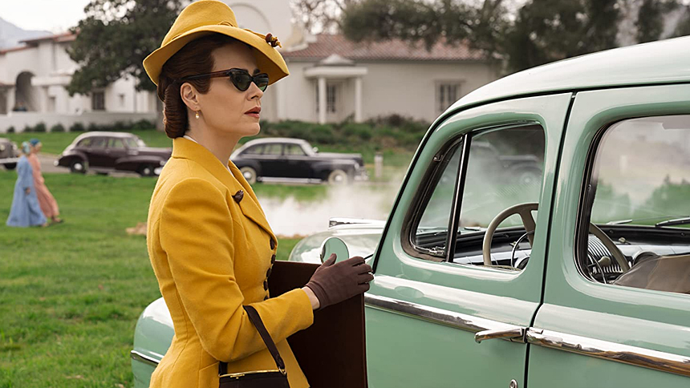
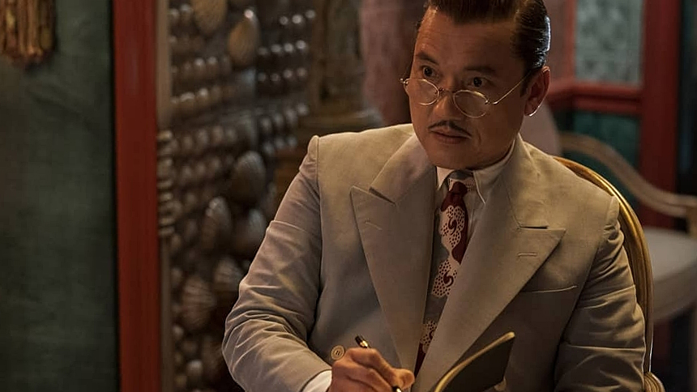

To się nie miało prawa udać - sygnowany przez Netflix projekt, za który odpowiada [Ryan Murphy](https://www.imdb.com/name/nm0614682/) - projekt mający pełnić rolę prequela do [One Flew Over the Cuckoo's Nest](https://www.imdb.com/title/tt0073486/), przedstawiając widzom genezę jednej z najbardziej wyrazistych postaci kobiecych kina XX wieku, zawodzi na wielu frontach. Niestety tych pod względem historii dobrej kinematografii najważniejszych.

Lot nad Kukułczym Gniazdem początkowo zadebiutował w 1962 roku, jako powieść autorstwa [Kena Kesey'a](https://pl.wikipedia.org/wiki/Ken_Kesey) - to świetna moim zdaniem historia ukazująca różne znamiona zniewolenia oraz tęsknoty za wolnością. Prezentowana również na deskach teatru, finalnie doczekała się ekranizacji - trafiając na wielki ekran w 1975 roku, rzutem na taśmę, film zdobywa pięć Oscarów.

[Louise Fletcher](https://www.imdb.com/name/nm0001221/) zostaje jedną z laureatek, otrzymując statuetkę za najlepszą pierwszoplanową rolę kobiecą - wcielając się w postać siostry Ratched wykreowała niesamowitą osobowość - archetyp kobiecego autorytetu - zimną, cechującą się brakiem współczucia, pełną nienawiści, protekcjonalną kobietę w pozycji władzy.

Ryan Murphy, znany miłośnikom seriali z takich produkcji, jak [9-1-1](https://www.imdb.com/title/tt7235466/), [American Horror Story](https://www.imdb.com/title/tt1844624/), [Hollywood](https://www.imdb.com/title/tt9827854/), [Pose](https://www.imdb.com/title/tt7562112/), czy też [The Politician](https://www.imdb.com/title/tt7971476/) jakimś cudem uznał, że jest w stanie przedstawić widzą dobrą i przede wszystkim wciągającą genezę tej ikonicznej już w branży filmowej postaci.

I mimo, że ten scenarzysta i producent telewizyjny ma na swoim koncie kilka naprawdę wysoko ocenianych produkcji, zarówno przez krytyków, jak i samą publiczność, to jednak w przypadku [Ratched](https://www.imdb.com/title/tt7423538/) zdecydowanie popłynął, popuszczając tak luźno wodze fantazji, że wyszła z tego wyjątkowo groteskowa momentami opowieść, niewiele wspólnego mająca z oryginałem.

Historia opowiedziana przez twórców rozpoczyna się w 1947 roku, kiedy to Mildred Ratched przybywa do Lucia w hrabstwie Monterey (Kalifornia, USA), podstępem otrzymując posadę pielęgniarki w czołowym stanowym szpitalu psychiatrycznym. Ukryte początkowo motywacje kobiety dość szybko wychodzą na światło dzienne, a akcja zaczyna się toczyć wartkim, ale jednocześnie bardzo chaotycznym tempem.

Pierwszym poważnym problemem jest mnogość wątków fabularnych, jakie scenarzyści postanowili wpleść w opowieść - wątków, które skutecznie odsuwają uwagę od postaci głównej bohaterki. Wątków tak durnowatych momentami, że nawet dobra obsada w postaci takich gwiazd, jak [Sarah Paulson](https://www.imdb.com/name/nm0005299/), [Judy Davis](https://www.imdb.com/name/nm0001114/), [Vincent D'Onofrio](https://www.imdb.com/name/nm0000352/), czy [Sharon Stone](https://www.imdb.com/name/nm0000232/) nie jest w stanie w żaden sposób uratować sytuacji.

Szkoda, bo gdyby z kilku z nich zrezygnować, dopracowując kształt pozostałych, utrzymać je bardziej w realiach otaczającego Ratched świata i dać naprawdę zabłysnąć niektórym postaciom, to fabularnie wydźwięk całości mógłby być zdecydowanie lepszy.

Zamiast tego mamy szpital psychiatryczny przypominający 5. gwiazdkowe sanatorium (mamy koniec lat 50. XX wieku), którym rządzi psychiatra nie mający pojęcia, nie tylko co się właściwie w szpitalu dzieje, ale na czym generalnie polega jego praca. Mamy masowego mordercę, który w żaden sposób nie jest ewaluowany. Mamy gubernatora starającego się o reelekcję, który swoją kampanię opiera o funkcjonowanie niedofinansowanego wcześniej szpitala.

Są motywy dawnych krzywd, płatnych morderców, historii miłosnych i wątków rodem z Bonnie i Clyde. Jest też potraktowany po macoszemu i wyświechtany temat traumy z dzieciństwa głównej bohaterki. Multum tego, ale zarazem nic, co by się konkretnie koncentrowało na postaci Ratched, której obecność, zaangażowanie oraz przede wszystkim rozwój psychiczny spychany jest z każdym kolejnym epizodem na dalszy plan.

To serial pełen karykaturalnych wątków, którym bliżej do American <s>Horror</s> Story, niż do wartościowego pod jakimkolwiek względem prequela Lotu nad Kukułczym Gniazdem. W ogóle używanie słowa preqel w przypadku tego serialu jest nie tylko nadużyciem, ale i obrazą oryginału.

Ale to nie koniec, bowiem Ryan Murphy, chcąc chyba zadowolić wszystkich, tylko nie miłośników dobrego kina, postanowił z Ratched nagle uczynić postać biseksualną - silnie akcentując nie tylko ten wątek, ale i kilka pomniejszych związanych z LGBTQ+. Jaki to miało cel? Nie mam bladego pojęcia.

Przypominam, że w oryginale wątek seksualności siostry Ratched nigdy nie był poruszany - zwyczajnie nie miał żadnego znaczenia, bowiem inne aspekty psyche kobiety były dla scenarzystów o wiele bardziej istotne, niż jej orientacja seksualna. Murphy jakimś cudem uznał, że nie tylko to ma znaczenie, ale i jest na tyle ważne, że warto pociągnąć sporą część fabuły wokół tego wątku.

Serio, aż strach pomyśleć, co się będzie wyprawiać w drugim sezonie, który niestety nieuchronnie zawita do nas w 2021 roku, a który dodatkowo po zakończeniu obecnej serii, nie zwiastuje niczego dobrego pod względem fabularnym.

Ratched, jako prequel Lotu nad Kukułczym Gniazdem zawodzi w każdy możliwy sposób. Jako serial natomiast będący częścią 'Murphyversum', całkowicie odseparowany od oryginału, jest zwyczajnie średni. Ale przynajmniej wygląda cudnie.
