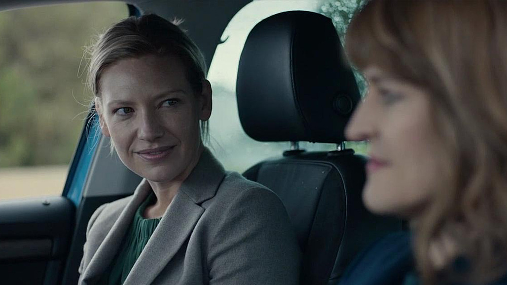
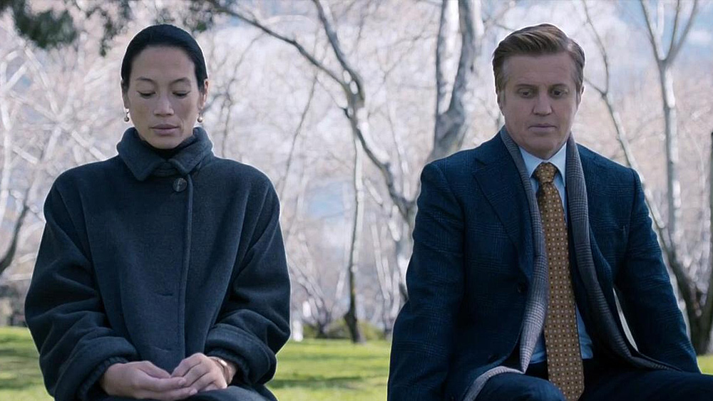
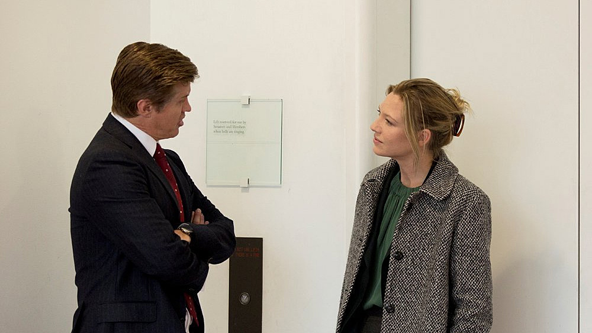

[Secret City](https://www.imdb.com/title/tt4976512/) to bez wątpienia jedna z lepszych produkcji w gatunku thrillera politycznego, jaka wyprodukowana została w Australii. To też bardzo dobry serial ogólnie, który mimo niewielkiej ilości epizodów opowiada wielowątkową, angażującą historię, której tematem przewodnim jest polityka, rosnące napięcie pomiędzy Chinami i USA, kłamstwa, korupcja oraz szpiegostwo.

Wielu z Was z pewnością pozna serial Secret City dzięki faktowi, że jego emisji podjął się Netflix (na tej platformie zadebiutował on 26 czerwca 2018 roku), jednak fakt jest taki, że początkowo serial ten miał swoją premierę w 2016 roku – wyprodukowany na zlecenie Showcase spotkał się z niezwykle ciepłym przyjęciem zarówno lokalnie, jak i wśród widzów, dla których położenie geograficzne nie odgrywa większej roli, jeśli wiecie, co mam na myśli…

Główną bohaterką opowieści jest Harriet Dunkley, w której rolę wciela się [Anna Torv](https://www.imdb.com/name/nm1396022/) ([Fringe](https://www.imdb.com/title/tt1119644/), [Mindhunter](https://www.imdb.com/title/tt5290382/), [Heavenly Sword](https://vgdb.pl/ps3/heavenly-sword)) – dziennikarka śledcza, która przypadkowo i wbrew własnej woli wciągnięta zostaje w wielowątkową intrygę, która zagraża nie tylko bezpieczeństwu narodowemu, ale i przede wszystkim samej kobiecie. A historia przygotowana przez scenarzystów zahacza o wyjątkowo wiele wątków – sprawę tybetu, tajemnicze morderstwa, korupcję na najwyższych stanowiskach australijskiego rządu, rosnące napięcie pomiędzy rządami Chin i USA – gdzieś w tym wszystkim istotną rolę odgrywa jednak Australia.

**Secret City to serial, który wypada oglądać z należną uwagą** – mimo małej ilości odcinków dzieję się naprawdę sporo, wiele tematów się wzajemnie przeplata, często ciężkimi do wychwycenia niuansami – do tego spore zawirowania fabularne, które atakują widzów w najmniej spodziewanym momencie. To przemyślany, ale i przede wszystkim bardzo wiarygodny thriller polityczny z wątkami dramatycznymi i kryminalnymi. Absorbująca opowieść, której przebieg i zakończenie (!!!) jest wyjątkowo satysfakcjonujące dla widza.

**To historia pod względem scenariusza dopracowana w wielu aspektach, przez co wydaje się autentyczna**. To też serial, który jest po prostu dobrze wyreżyserowany i obsadzony wieloma znanymi postaciami z ekranu telewizyjnego – może nie globalnie (pomijając Annę Torv), ale występujące tu postaci i drugoplanowa obsada, zapewniam Was, nie jest wybrana przypadkowo. Pełno tu wyrazistych charakterów, którzy są dobrze nakreśleni przez scenarzystów, mają swoje motywacje, ideologie, co wpływa dodatkowo pozytywnie na odbiór ich wiarygodności. Nic nie dzieje się przypadkowo, wszystko wydaje się uzasadnione, oparte na solidnych podstawach.

A pomyśleć, że to wszystko, naprawdę gruba intryga polityczna, ma swój początek w działaniach australijskiej aktywistki, młodej dziewczyny, która będąc na wymianie naukowej w Chinach, walcząc o prawa wolnego Tybetu, postanawia w proteście przeciw działaniom władz podpalić swoje ciało. I od mężczyzny, który 7 tysięcy kilometrów na południe od tego zdarzenia, zostaje znaleziony martwy.

Polecam.