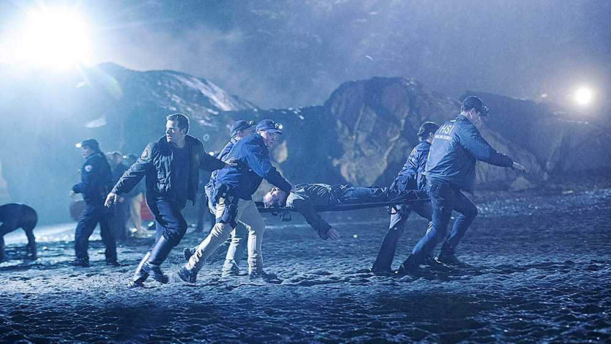

Słowo idealnie opisujące mój stosunek względem serialu [The Crossing](https://www.imdb.com/title/tt6461824/) to 'ambiwalentny' i właśnie ta fraza jest sponsorem dzisiejszej recenzji - bo z jednej strony pierwszy sezon tej produkcji przygotowany jest według sprawdzonych schematów, które trzymają widza przy ekranie...

Z drugiej natomiast nie jest to serial moim zdaniem tak dobry, jak mogłyby początkowo wskazywać średnie ocen chociażby w serwisie IMDb - ot, takie guilty pleasure. W dodatku pełne zmarnowanego potencjału, chociaż za produkcją tego serialu stoją znane wydawałoby się nazwiska. Ale do tego jeszcze dojdziemy.

The Crossing opowiada historię uchodźców z odległej o prawie 200 lat przyszłości, którzy lądują w teraźniejszości uciekając przed światem rozdartym wojną - pojawiając się nagle z malowniczym miasteczku Port Canaan (Oregon) pragną po prostu azylu. Tyle tytułem wstępu - zresztą sam zarys fabularny doskonale nakreślony został w [zwiastunie premierowym](https://www.youtube.com/watch?v=vq4w6GhDTmU), który swoją drogą zachęcam zobaczyć.

Za stworzenie serialu odpowiada przede wszystkim duet: Jay Beattie oraz Dan Dworkin – panowie mający wcześniej przyjemność pracować nad takimi produkcjami telewizyjnymi, jak The Event, Surface, Scream, Vanished, czy też Criminal Minds - na potrzeby niniejszej recenzji pomińmy ostatni procedural, znacie schemat? **Tak właśnie skonstruowany jest The Crossing, oparty na podobnych, tanich chwytach serial**, który początkowo ciekawy wątek niszczy dziwnymi pomysłami, lukami fabularnymi i tanimi splotami scenariusza - no generalnie w pewnym momencie całość nie trzyma się kupy.

Ale to się całkiem dobrze ogląda - tyle, że (to bardzo ważne) trzeba na pewne elementy zwyczajnie przymknąć oko, bo jak zdążyłem wspomnieć w pierwszym akapicie tego tekstu jest to serial typowo rozrywkowy, przy którym wypadałoby wyłączyć myślenie i dać się wciągnąć w przygotowaną przez scenarzystów historię. Ta, owszem, momentami potrafi absorbować, w dużej mierze za sprawą dynamiki akcji i kilkoma interesującymi wątkami - chcemy wiedzieć, co stanie się dalej, to naturalne. A wspomniany wyżej duet, wie jak podtrzymać to napięcie.

Z drugiej strony to taka rozrywka na chwilę - pisząc ten tekst równo dwa tygodnie po emisji ostatniego odcinka pierwszego sezonu łapałem się na tym, że musiałem sobie pewne wątki przypomnieć - **The Crossing nie ma w sobie żadnego elementu, który pozostałby w pamięci na dłużej** - to taka pusta odskocznia, bez żadnej głębi, czasem siląca się na poruszenie kilku ważnych tematów, ale robiąca to na tyle nieudolnie, że generalnie nie zwraca się na to szczególnej uwagi.

Drażni gra aktorska, drażnią płaskie postaci, drażnią luki fabularne, czy też brak logiki w wielu aspektach fabuły – pod tym względem jest naprawdę słabo. Poziom irytacji tymi elementami rośnie wraz z każdym kolejnym epizodem serialu. Nadrabia on jednak wartką akcją, sposobem prowadzenia narracji, twistami fabularnymi - nie są to elementy co prawda najwyższych lotów, ale potrafią utrzymać skupienie widza. Szkoda, że sam scenariusz wypada przy tych elementach, jak pisany zupełnie 'na kolanie'.

Czy polecam? Niekoniecznie. Owszem, zaczyna się to nieźle, ale **poziom pilotowego odcinka, nawet w kategoriach guilty pleasure, znacznie odbiega od tego, co dzieje się w następnych epizodach**. Potrafi wciągnąć, to prawda, ale cóż, pozostawia po sobie taki ‚ambiwalentny’ stosunek. Jest wiele o niebo lepszych seriali. Nawet w kategorii typowo rozrywkowej.