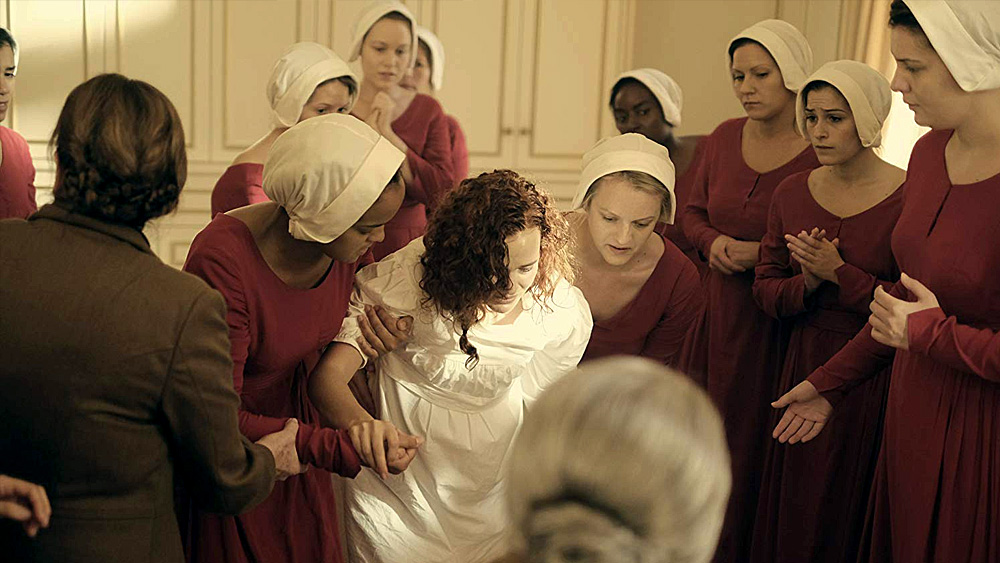
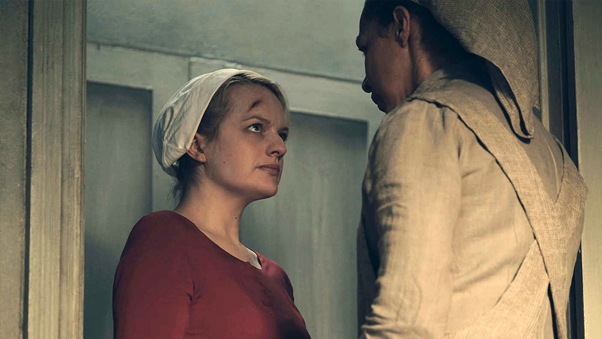
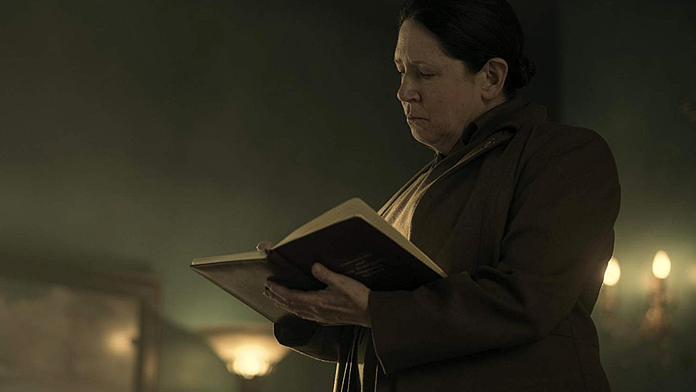
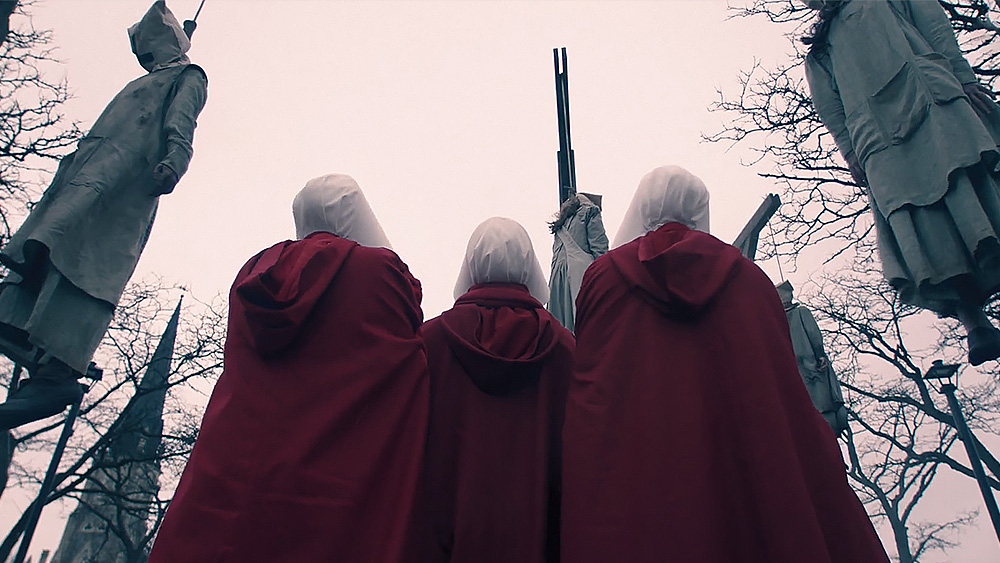
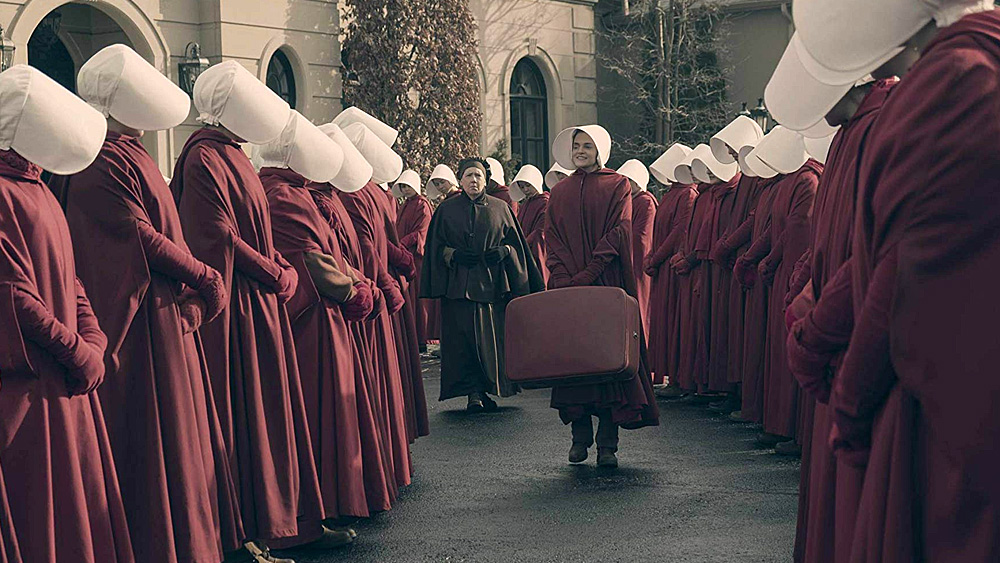

Niedaleka przyszłość. W wyniku chorób przenoszonych drogą płciową i zanieczyszczeniu środowiska, współczynnik dzietności na świecie spada praktycznie do zerowego poziomu. Na terenie Stanów Zjednoczonych wybucha wojna domowa, dotychczasowy rząd zostaje obalony, **władzę przejmuje totalitarna, teokratyczna, pseudochrześcijańska junta, tworząc tym samym republikę Gilead**.

Społeczeństwo prowadzone jest przez żądnych władzy liderów i zmilitaryzowany reżim fanatyków, którzy ustalają nowe klasy społeczne - w których **kobiety zostają zdegradowane, pozbawione wszelkich praw, własności, pieniędzy, nawet... możliwości czytania**.

Postępująca bezpłodność prowadzi do uwięzienia zdrowych, w pełni zdolnych do rodzenia potomstwa kobiet. Ekstremiści, powołując się na biblijną interpretację Bilha (postać ze Starego Testamentu, Księga Rodzaju 29,29; 30,3-7), nazywają niewolnice podręcznymi. Kobiety te zostają oddelegowane do domów elit, **uczestnicząc w rytualnym, comiesięcznym gwałcie, rodzą dzieci wysoko postawionym urzędnikom Gilead**.

Tak prezentuje się zarys fabularny [The Handmaid's Tale](https://www.imdb.com/title/tt5834204/), przygotowanego przez stację Hulu dramatu science-fiction, którego pierwszy sezon zadebiutował na ekranach 26 kwietnia 2017 roku. Serialu, który jest adaptacją wydanej w 1985 roku powieści autorstwa [Margaret Atwood](https://en.wikipedia.org/wiki/Margaret_Atwood) - kanadyjskiej poetki, pisarki i krytyk literackiej, która za swoją twórczość uhonorowana została szergiem [prestiżowych nagród](https://en.wikipedia.org/wiki/Margaret_Atwood#Awards).

I już na wstępie zaznaczę - **przedstawiona w The Handmaid's Tale historia jest jednym z najmocniejszych filarów serialu**. Raz, że sama konstrukcja świata jest dopracowana w najdrobniejszych detalach, tak i sposób prowadzenia i opowiadania historii widzom wydaje się nader interesujący. Nie dostajemy wszystkiego na tacy, zamiast tego wątki prowadzone są dwutorowo prezentując nam zarówno aktualny wygląd republiki Gilead, jak i wydarzenia z przeszłości, które krok po kroku doprowadziły do utworzenia teokratycznego państwa.

Na plus bez wątpienia zasługuje również konsekwencja w obrazowaniu postapokaliptycznego świata - **dystopia jest tematem niezwykle popularnym w popkulturze ostatnich lat, jednakże nie zawsze udaje się przedstawić ją tak, jak moim zdaniem powinna być przedstawiona** - z pełną jej brutalnością, mrocznym światem przyszłości i beznadziejnym losem żyjących w niej bohaterów, gdzie nie ma światełka w tunelu.

Świat w The Handmaid's Tale wygląda tak jak powinna wyglądać dystopijna rzeczywistość. Twórcy wykorzystują wiele środków, by pokazać nam, że otaczająca bohaterów codzienność jest przerażająca, pełna bólu, tęsknoty, upokorzenia, pozbawiona ludzkiej godności i przede wszystkim pełna brutalności. To nie jest miejsce, w którym chciałby żyć ktokolwiek z nas, bez względu na reprezentowaną płeć.

Z drugiej jednak strony, mimo tego wszystkiego, **wykreowany w The Handmaid's Tale świat jest, o dziwo, ogromnie fascynujący**. Wzbogacony świetnym tłem fabularnym angażuje widza na każdym kroku. To miejsce, o którym chcemy wiedzieć coraz więcej, a atmosfera i szczątkowe dawkowanie informacji tylko podsyca to uczucie.

Dodajmy teraz do tego wszystkiego [Elisabeth Moss](https://www.imdb.com/name/nm0005253/) - zdobywczyni dwóch złotych globów (jeden właśnie za recenzowany tu serial, drugi natomiast za bardzo dobry moim zdaniem [Top of the Lake](https://www.imdb.com/title/tt2103085/)). Aktorka wciela się w rolę głównej bohaterki o imieniu June (a w zasadzie Offred, bo takie imię zostaje jej nadane w świecie, w którym przyszło jej żyć) i po raz kolejny dowodzi, że warsztat pracy ma opanowany do perfekcji.

Elisabeth to osoba, która gra całą sobą, przez co kreowane przez nią postaci są tak bardzo wiarygodne - a w The Handmaid's Tale nie miała łatwego zadania, bowiem serial, ze względu na swoją emocjonalną naturę, wymagał od niej perfekcyjnego przygotowania do roli. Kilka scen, które przyjdzie Wam zobaczyć przy okazji 1. sezonu doskonale obrazuje, co mam w tym miejscu na myśli.

**The Handmaid's Tale to również bardzo dobrze zrealizowany serial od strony stricte technicznej** - warto docenić nie tylko reżysera, ale również scenografów, operatorów kamery i przede wszystkim osoby odpowiedzialne za przygotowanie kostiumów. To momentami naprawdę piękne widowisko, z zapadającymi w pamięć kadrami budowanymi scenografią, rekwizytwami, światłem oraz pracą samej kamery.

**Nie wszystko mi jednak w tej produkcji leży, jakby sugerowała treść recenzji** - sporym minusem jest na pewno wolne tempo prowadzenia akcji, które tak naprawdę jest powodem, dla którego niniejsza recenzja powstaje dopiero teraz. Oglądając 'Opowieści Podręcznej' w okolicach premiery przerwałem w połowie - dzisiaj okazuje się, że niesłusznie, ale sposób prowadzenia akcji może być dla wielu osób barierą.

Również zakończenie nie należy do tych satyfakcjonujących, ale to już bezpośrednia wina autorki powieści, na której został oparty serial. Tym bardziej, że pierwszy sezon wyczerpuje oryginalną treść książki i gdyby nie zamówienie przez Hulu kolejnych sezonów i radosna twórczość scenarzystów, to The Handmaid's Tale skończyłoby się w sposób, który zostawia widza z ogromnym uczuciem zawieszenia i niedosytu. Innymi słowy, zostalibyśmy w miejscu, w którym wszystko się tak naprawdę zaczyna.

Koniec końców, **The Handmaid's Tale to jednak bardzo dobry serial dramatyczny**, który porusza wiele istotnych społecznie tematów, często między wierszami i nie tylko tych związanych z degradacją społeczną kobiet. Zmusza tym samym do refleksji, co jest jego bezsprzeczną zaletą...