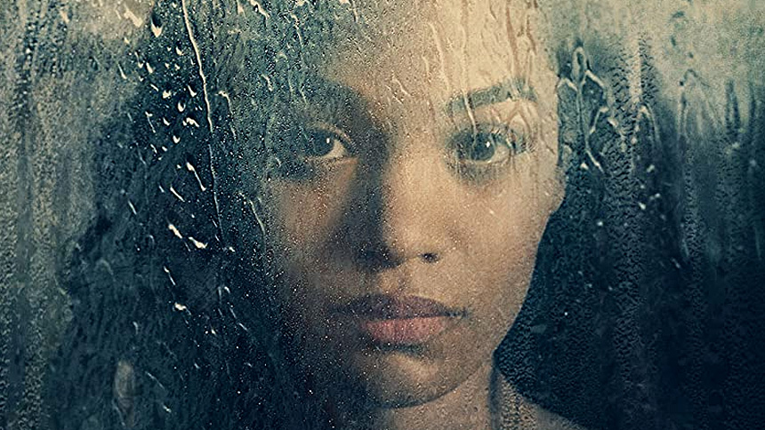

[Mike Flanagan](https://www.imdb.com/name/nm1093039/) tworząc [The Haunting of Bly Manor](https://www.imdb.com/title/tt10970552/), kolejną część antologii zapoczątkowanej w 2018 roku przez [The Haunting of Hill House](https://www.imdb.com/title/tt6763664/), postanowił obrać zupełnie inną strategię. Drogę która nie tylko pozwala rozwinąć skrzydła jego twórczości, ale udowadnia, że zespół, z którym pracuje, to wyjątkowo wszechstronni pod względem warsztatu aktorzy, potrafiący odnaleźć się w wielu, często dość skrajnych sytuacjach.

Historia zaprezentowana w The Haunting of Bly Manor to luźna, cechująca się ogromnym wkładem własnym adaptacja [The Turn of the Screw](https://en.wikipedia.org/wiki/The_Turn_of_the_Screw), wydanej w 1898 roku noweli autorstwa Henry'ego Jamesa, która oryginalnie ukazała się w odcinkach na przestrzeni trzech miesięcy, na łamach amerykańskiego tygodnika Collier.

To opowieść zgoła odmienna od tego, do czego przyzwyczaił nas serial The Haunting of Hill House. To zupełnie inny tor narracji, inne tempo historii, inna atmosfera i przede wszystkim inne założenia - i to jedna z największych zalet antologii - możliwość zabawy formą, czy też samą konwencją. A Mike Flanagan wyjątkowo skutecznie to wykorzystuje, nadal jednak pozostając bliski korzeniom, na których buduje markę The Hauting.

Witajcie w drugiej połowie lat 80. XX wieku, witajcie w Bly - przepięknej wiktoriańskiej posiadłości, usytuowanej w odległych, urokliwych i zarazem spokojnych zakątkach hrabstwa Essex. To właśnie tutaj swoją pracę w roli guwernantki zaczyna młoda amerykanka - Dani Clayton (w tej roli [Victoria Pedretti](https://www.imdb.com/name/nm6442992/)), której zadaniem jest edukacja oraz opieka nad dwójką dzieci osieroconych w wyniku nieszczęśliwego wypadku.

Miles ([Benjamin Evan Ainsworth](https://www.imdb.com/name/nm9974256/)) i Flora ([Amelie Bea Smith](https://www.imdb.com/name/nm9541566/)), młode rodzeństwo, niesie za sobą olbrzymie brzemię - tragiczna i niespodziewana śmierć rodziców oraz tajemnicze samobójstwo poprzedniej guwernantki, to jednak tylko preludium do wydarzeń, których świadkiem widzowie będą przez kolejne odcinki The Haunting of Bly Manor.

Przez kilka pierwszych epizodów historia rozwija się spokojnym tempem - twórcy The Haunting of Bly Manor niespecjalnie się spieszą z rozwojem akcji - to moment, żeby w dogłebny sposób przedstawić widzom realia, bohaterów oraz posiadłość w Bly. To czas na nakreślenie motywacji głównych postaci, ich genezy oraz dobry moment, na ukierunkowanie widza w stronę właściwej historii.

Zabieg ten jednak nie wszystkim przypadnie do gustu, bowiem leniwe otwarcie tej części antologii jest zarazem jedną z większych jej wad w odczuciu ogółu publiczności. To też moment, w którym większość z Was zrozumie, że Nawiedzony Dwór w Bly to historia, która z The Haunting of Hill House ma naprawdę niewiele wspólnego. 

Jeżeli ponownie liczyliście na dobrej klasy serialowy horror, to będzie moment rozczarowania. Bly Manor, owszem, opowiada historię o duchach, ale zgodnie z konwencją, na której scenariusz został oparty, to iście wiktoriańska narracja, której celem jest nie tyle straszyć, co wywołać w widzach swoiste uczucie niepokoju. I pod tym względem The Haunting of Bly Manor sprawdza się naprawdę świetnie.

I to jest też moment, w którym zaprezentowana widzom historia zaczyna pokazywać prawdziwy pazur.

Poszczególne wątki zaprezentowane w początkowych epizodach zaczynają się ze sobą zazębiać - te subtelne sygnały twórców antologii przestawiane nam od pierwszych odcinków nagle zaczynają mieć sens, a sama opowieść? Ta zaczyna wciągać jak bagno.

Witajcie w Bly, chciałbym rzecz ponownie - witajcie w jednej z najpiękniejszych miłosnych opowieści o duchach, jaką przyjdzie Wam przeżyć. The Haunting of Bly Manor to naprawdę dobrze rozpisana historia o bezgranicznej miłości, smutku, żałobie, nienawiści i przede wszystkim - nadziei. To iście wiktoriański romantyzm wsparty lekką dawką grozy, która nie tyle straszy, ale systematycznie potęguje uczucie niepokoju.

To też świetny pokaz swobodnej zabawy konwencją - ósmy epizod, to jeden z tych odcinków, które nie tylko zapadają w pamięć na długo, ale to też jedna z najlepiej przedstawionych genez historii o duchach - siada tutaj wszystko - od reżyserii poczynając, poprzez stylistykę, narrację (cudowna [Carla Gugino](https://www.imdb.com/name/nm0001303/) w roli narratorki całego serialu), a na aktorstwie kończąc.

Więc może warto wrócić do początkowej myśli - Mike Flanagan stworzył naprawdę solidny zespół niezwykle utalentowanych aktorów, którzy nie tylko potrafią ze sobą współpracować, ale też cechują się niebanalnym warsztatem - są po prostu autentyczni, co jest ogromnym plusem w wybranym przez twórcę gatunku.

Będziecie nie tylko miło zaskoczeni tym, jak spora częśc obsady z The Haunting of Hill House powraca w drugiej części antologii, ale również tym, jak odmienne postaci potrafią wykreować i mimo tego świetnie ze sobą współgrać.

Ale Bly Manor to również nowe twarze - [T'Nia Miller](https://www.imdb.com/name/nm2761963/) z [Years and Years](/recenzja-serialu-years-and-years/), czy wspomniane przeze mnie pierwszoplanowe postaci dziecięce - aktorstwo, autentyczność i zaangażowanie, to zdecydowanie jedna z najmocniejszych stron antologii.

The Haunting of Bly Manor nie jest serialem idealnym. Ale to kawał dobrego rzemiosła, które cechuje się poważnym podejściem do przedstawianego przez siebie tematu. Owszem, to nie jest horror, ale to jedna z najpiększniejszych historii miłosnych o duchach, jaką miałem przyjemność oglądać.

Perfectly splendid!
