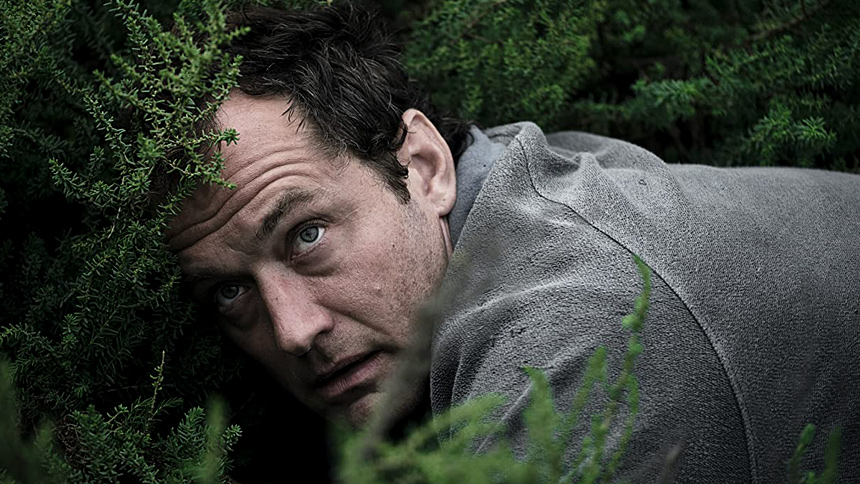

The Third Day to serial dobrze zrealizowany technicznie, z angażującym otwarciem, ciekawym miejscem akcji, intensywnym klimatem i dobrą obsadą aktorską. To wszystko jednak nie wystarczyło, by konsekwentnie utrzymać wysoką jakość produkcji i historię zapadającą na dłużej w pamięci widzów.

...

...

...

...

...

