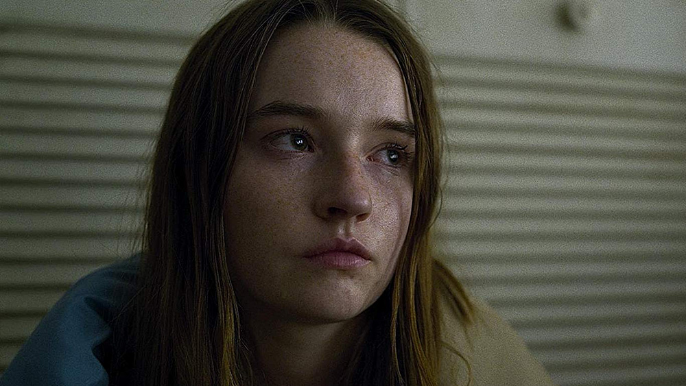
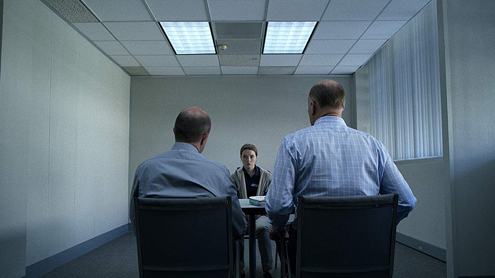
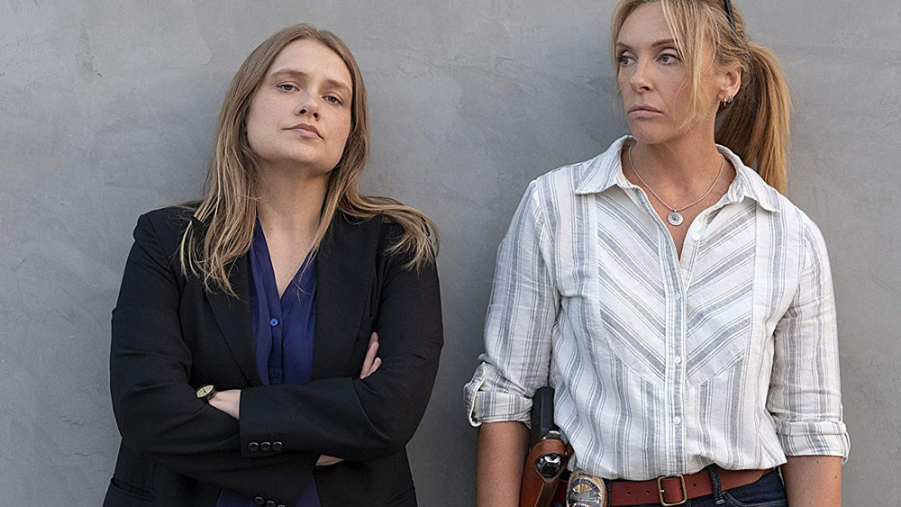
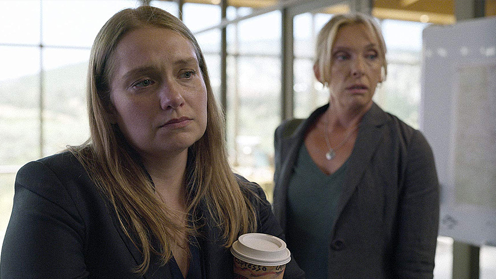
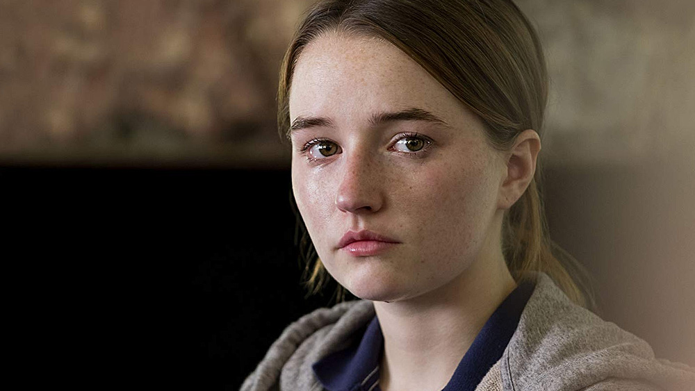

[An Unbelievable Story of Rape](https://www.propublica.org/article/false-rape-accusations-an-unbelievable-story) to opublikowany w 2015 roku reportaż, którego autorem jest T. Christian Miller, Ken Armstrong, charytatywna organizacja ProPublica oraz projekt Marshall. To szczegółowy zapis prawdziwej historii młodej, brutalnie skrzywdzonej dziewczyny i policyjnego śledztwa w sprawie gwałtu dokonanego na 18-latce. Problem w tym, iż kobieta odwołała zeznania twierdząc, że opowiedziana przez nią początkowo historia została zmyślona.

To reportaż, który jego autorom zapewnił prestiżową nagrodę Pulitzera. Dobry materiał źródłowy na wciągający serial dokumentalny, prawda? Tym bardziej, że ekranizacja stworzona została przez Netflix - platformę, którą wielokrotnie chwaliłem w kontekście naprawdę wysokiej jakości przygotowywanych seriali dokumentalnych. Otóż nie tym razem...

Netflix książkowo wręcz zmarnował nie tylko potencjał całej historii, ale przede wszystkim wykazał brak poszanowania dla ofiar prezentowanych w [Unbelievable](https://www.imdb.com/title/tt7909970/) wydarzeń i wysnuł naprawdę niebezpieczne społecznie tezy, których o zgrozo zdają się nie zauważać mainstreamowe media. To wszystko podane w otoczce poprawnych politycznie ideologii (z ruchem #MeToo na czele), przesadnego seksizmu skierowanego w stronę mężczyzn i mizoginii.

Ale zacznijmy od początku, bowiem otwarcie serialu Unbelievable zwiastuje naprawdę dobrą historię dramatyczną - opowieść o losach Marie Adler, dziewczyny ciężko potraktowanej przez życie, wychowywanej w rodzinach zastępczych, żyjącej obecnie w ośrodku przygotowującym młodzież do samodzielnego, odpowiedzialnego życia.

Gehenna kobiety zaczyna się w momencie napaści seksualnej, wynikiem której jest gwałt, a to niestety dopiero początek poważnych zawirowań w jej życiu. W wyniku szoku, Marie nie jest w stanie dokładnie przedstawić przebiegu wydarzeń, czterokrotnie przesłuchiwana myli wątki, co wprowadza śledczych w konsternację, a zeznania kobiety poddaje w uzasadnioną w takim przypadku wątpliwość. Tym bardziej, że dowodów na rzeczony gwałt nie było wówczas żadnych.

Samotna, pozbawiona przez najbliższych wsparcia, przerażona konsekwencjami niespójnych zeznań, dziewczyna odwołuje wniesione oskarżenia twierdząc, że przedstawiona przez nią historia została zmyślona. To wydarzenie zmieni życie Marie nie do poznania.

Pierwszy epizod Unbelievable to kawał dobrego widowiska, w którym zagrało naprawdę większość elementów - angażujący wstęp do historii, dobry montaż, dobra reżyseria i świetne aktorstwo w wykonaniu głównej bohaterki tej nieszczęsnej opowieści, w którą wciela się [Kaitlyn Dever](https://www.imdb.com/name/nm3239803/). Ale nie tylko jej, bo kompletu wrażeń dopełniają ciekawie rozpisane dialogi i postaci drugoplanowe.

Początek Unbelievable daje nadzieję na kolejny świetny dokument Netflixa - pracują wszak na świetnym materiale źródłowym. Tak się jednak nie dzieje, bo dobrze rozrysowana początkowo historia schodzi na dalszy plan już w drugim epizodzie, a wątkiem głównym staje się prowadzone trzy lata później policyjne śledztwo.

A jakość serialu drastycznie i konsekwentnie leci niestety w dół.

Na pierwszy plan opowieści wychodzi policyjny duet prowadzący dochodzenie: Grace Rasmussen ([Toni Collette](https://www.imdb.com/name/nm0001057/)) i Karen Duvall ([Merritt Wever](https://www.imdb.com/name/nm0923266/)) skutecznie psując klimat nakreślony w pilotowym odcinku Unbelievable. Ale nie o sam klimat, czy ton opowieści chodzi...

Upadać zaczyna niestety każdy z filarów serialu - aktorsko obie Panie starają się tak bardzo, że całość robi się niestety przerysowana, sztuczna i momentami wyjątkowo drewniana. Ale to nie do końca ich wina - wina leży po stronie scenarzystów i materiału, z jakim przyszło aktorom pracować. A scenarzystów poniosła naprawdę ułańska fantazja.

**Witajcie bowiem w rzeczywistości, w której każdy facet jest mizoginistyczną świnią**. Elementem wykazującym się brakiem zrozumienia, szacunku i empatii względem kobiet. Witajcie w świecie, w którym KAŻDE oskarżenie o napaść seksualną, czy gwałt trzeba uznać za prawdziwe - zdajecie sobie sprawę, jak bardzo przejebane byśmy mieli, gdyby policja i prokuratura kierowała się tą pokrętną, nie mającą nic wspólnego z otaczającym nas światem logiką?

Skala zjawiska związanego z fałszywym oskarżeniem o gwałt już i tak jest ogromna, dobrze jednak że coraz częściej wykrywana. Co jednak robią scenarzyści? Karmią nas feministycznym, seksitowskim gównem, w którym kobieta nigdy nie kłamie i zawsze jest uosobieniem cnót. A mężczyzna? To statystycznie oprawca, będący przyczyną przemocy domowej i napaści seksualnych. Taki obraz.

Wiecie, co najbardziej w Unbelievable irytuje? Nie przedstawiona tutaj ideologia, ale fakt, iż na jej cześć główny i najważniejszy wątek, na jakim opierał się serial został zamieciony pod dywan i prezentowany jest zwyczajnie po macoszemu. Kolejne ofiary gwałciciela, to według twórców nic nie znaczące wstawki - ich historie, dramaty i próby powrotu do codzienności po traumatycznych wydarzeniach są nieistotne. Bo jak można nazwać inaczej poświęcenie tym wątkom kilku minut na każdy epizod?

Za to mamy policyjne śledztwo, przeciągnięte wątki sprawy kryminalnej, procedury, spotkania i wygłaszane oświadczenia oraz wykłady, bo dialogami ciężko nazwać zaproponowaną przez twórców strukturę konwersacji.

A mogłoby wyglądać to lepiej, wystarczyło skrócić ilość epizodów o połowę, zintensyfikować tempo akcji i skupić się na tym, że 'niewiarygodne', to przede wszystkim historia dramatu ofiar przedstawionych tu wydarzeń.

Unbelievable nie spełnia oczekiwań, jakie w tym konkretnym serialu pokładałem. Scenariusz akcentuje elementy historii, które są wyjątkowo mało istotne, marginalizując przy tym to, co jest naprawdę w tym wszystkim ważne. Cierpi na tym ogólny obraz i sam widz, który karmiony jest naprawdę zbędną treścią - do tego uformowaną pod konkretną, niczym nieuzasadnioną tezę.

Wyszło to więc wszystko tak sobie, bo i ile technicznie niewiele tej produkcji można zarzucić, to w wielu pozostałych aspektach jest to po prostu zwyczajny, przy tym nadmiernie rozdmuchany medialnie średniak.