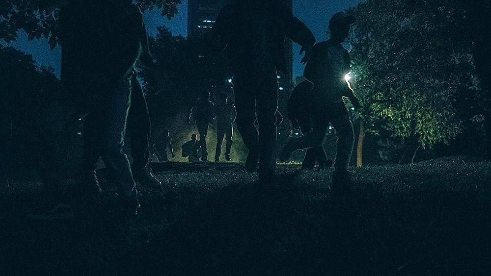
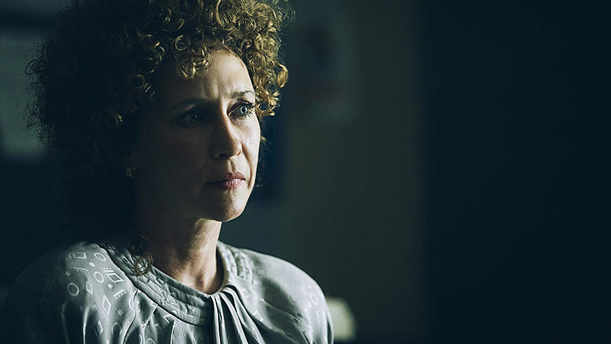
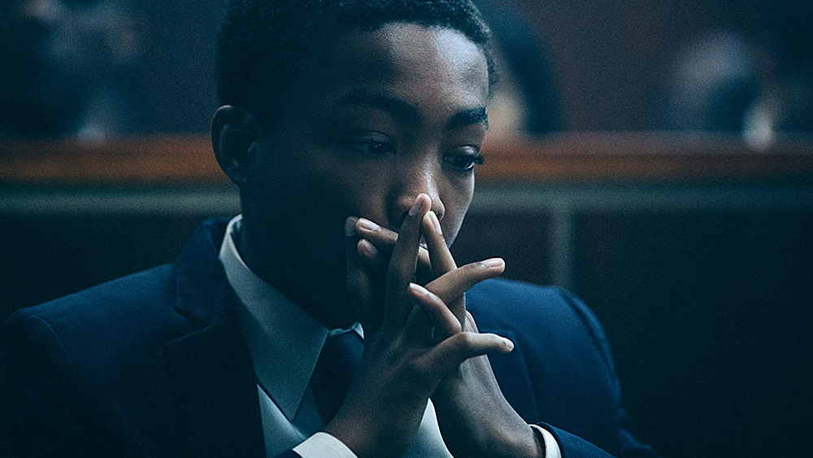
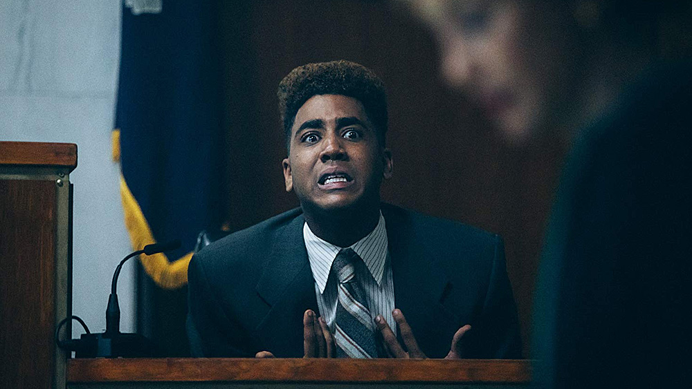
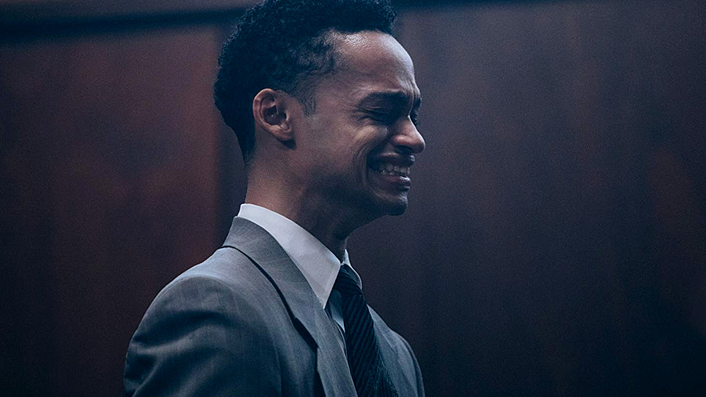

19 kwietnia 1989 roku, pięcioro ciemnoskórych nastolatków zostaje aresztowanych pod zarzutem zbiorowego gwałtu i ciężkiego pobicia młodej, białej kobiety na terenie Central Parku (Nowy Jork). Ofiara tego zdarzenia, Trisha Meili, nie pamięta nic z wydarzeń tej feralnej nocy.

Mimo braku jakichkolwiek fizycznych dowodów łączących chłopców z tym brutalnym napadem: Raymond Santana (14), Kevin Richardson (14), Yusuf Salaam (15), Antron McCray (15) oraz Korey Wise (16) zostali skazani za popełenie zbrodni, z którą nie mieli nic wspólnego. Ta przerażająca historia, określana w mediach jako '[Central Park Five](https://en.wikipedia.org/wiki/Central_Park_jogger_case)', wydarzyła się naprawdę.

[When They See Us](https://www.imdb.com/title/tt7137906/) to serial dokumentalny, który po raz kolejny udowadnia, że gatunek ten jest jednym z najmocniejszych stron Netflixa - serial, jaki wchodzi na salony trochę tylnimi drzwiami, bez przesadnej kampanii marketingowej, ale jednocześnie jest to widowisko zrealizowane pod wieloma względami po prostu rewelacyjnie.

**When They See Us** to czteroodcinkowy mini-serial, w którym każdy z epizodów koncentruje się na innym, specyficznym aspekcie historii - taka konstrukcja scenariusza niezwykle dobrze pasuje do opowiedzianych tutaj wydarzeń, jest angażująca, dramatyczna i momentami, zapewniam, bardzo ciężka w odbiorze. To serial nacechowany naprawdę silnym ładunkiem emocjonalnym.

Pierwszy z epizodów opowiada o wydarzeniach z 19 kwietnia 1989 roku - męczących i sprzecznych z ogólnie przyjętymi zasadami przesłuchaniami chłopców oraz próbie zbudowania przez oskarżycieli (Linda Fairstein - [Felicity Huffman](https://www.imdb.com/name/nm0005031/) i Elizabeth Lederer - [Vera Farmiga](https://www.imdb.com/name/nm0267812/)) sprawy opartej, cóż, na niczym. A zarzuty prokuratura wysuwa poważne - napaść, rabunek, udział w zamieszkach, napaść na tle seksualnym, gwałt i usiłowanie zabójstwa.

Drugi z nich wiąże się z szeroko omawianym publicznie procesem sądowym, który kończy się skazaniem wszystkich oskarżonych chłopców.

Trzeci epizod koncentruje się na czwórce najmłodszych 'bohaterów' historii, ich życiu w więzieniu oraz próbie powrotu do normalności po odbyciu kary. Ostatni natomiast opowiada tragiczną historię najstarszego z chłopców (Korey Wise), który w więzieniu spędził aż 12 lat, cierpiąc okropnie w wyniku wielu nadużyć, prześladowania oraz długotrwałego przebywania w izolatce.

W rolę reżyserki i jednocześnie osoby współtworzącej scenariusz When They See Us wcieliła się [Ava DuVernay](https://www.imdb.com/name/nm1148550/) - drodzy Państwo, **wyrazy uznania dla tej Pani za perfekcyjną wizualizację mrożącej krew w żyłach i łamiącej serce historii jednej z największych wpadek amerykańskiego wymiaru sprawiedliwości**.

Sprawy, która przede wszystkim nieodwracalnie zniszczyła życie nie tylko piątce młodych ludzi, ale również członkom ich rodzin. To historia pełna debilizmu i brutalności nowojorskiej policji, politycznych presji oraz bezwględnych mediów, które za sprawą prasy i telewizji szybko ukierunkowały narrację, przedstawiąjąc 'piątkę w Central Parku' w niezwykle niekorzystnym świetle.

To również historia pełna psychicznego cierpienia, przemocy oraz uprzedzeń - obraz tego, jak wyglądało życie biednego, ciemnoskórego społeczeństwa pod koniec lat 80. ubiegłego wieku. Ale mimo tego, to także opowieść o walce, przetrwaniu i chęci życia, która mimo że kończy się pozytywnym akcentem, to na stałe zostawia za sobą ślad w psychice właściwych bohaterów tych wydarzeń.

Ale przedstawiona tutaj historia musiała zostać wsparta przez grupę utalentowanych aktorów, bo tylko dobre kreacje oryginalnych bohaterów miały szansę urzeczywistnić obraz oraz przekazać stosowne emocje - [Asante Blackk](https://www.imdb.com/name/nm10040186/) (Kevin), [Caleel Harris](https://www.imdb.com/name/nm4144312/) (Antron), [Ethan Herisse](https://www.imdb.com/name/nm5376232/) (Yusef), [Marquis Rodriguez](https://www.imdb.com/name/nm2532658/) (Raymond) oraz [Jharrel Jerome](https://www.imdb.com/name/nm7851611/) (Korey) bezsprzecznie stanęli na wysokości zadania, fenomenalnie wcielając się w swoje role.

I o ile każdy z nich poradził sobie naprawdę świetnie w ożywieniu swojej postaci, tak Jharrel wcielający się w rolę Korey'a podniósł poprzeczkę naprawdę bardzo wysoko, co też zostało docenione przez krytyków i publiczność: nominacje do nagród Primetime Emmy i Gold Derby, czy też główna nagroda w Black Reel i African-American Film Critics Association.

**When They See Us to naprawdę niesamowity serial, który powinien zobaczyć bez wyjątku każdy**. Twórcy projektu oraz platforma streamingowa Netflix zasługują na słowa uznania, bo efektem tych prac jest rewelacyjne, pełne sprzecznych i silnych emocji widowisko, które nikogo nie zostawi objętnym. To jeden z tych seriali, które zapadają w pamięć, z pięknym pod względem kinematografii i aktorstwa finałem w postaci czwartego epizodu. Gorąco polecam!