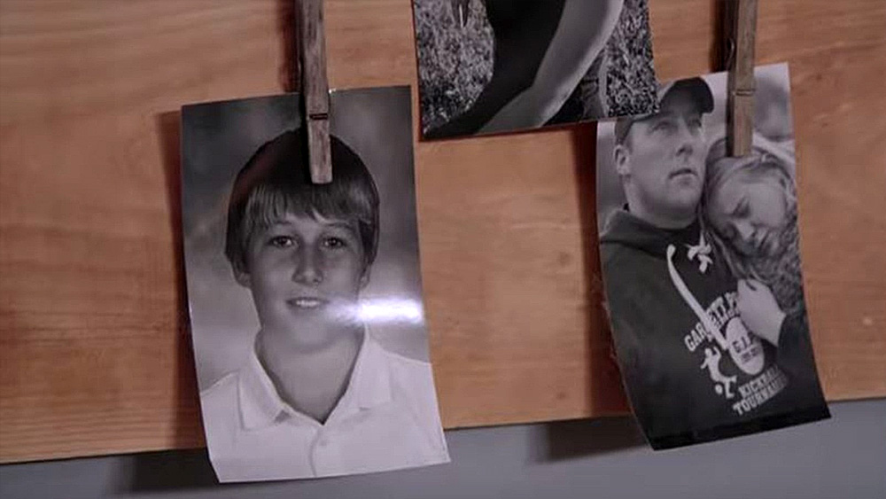
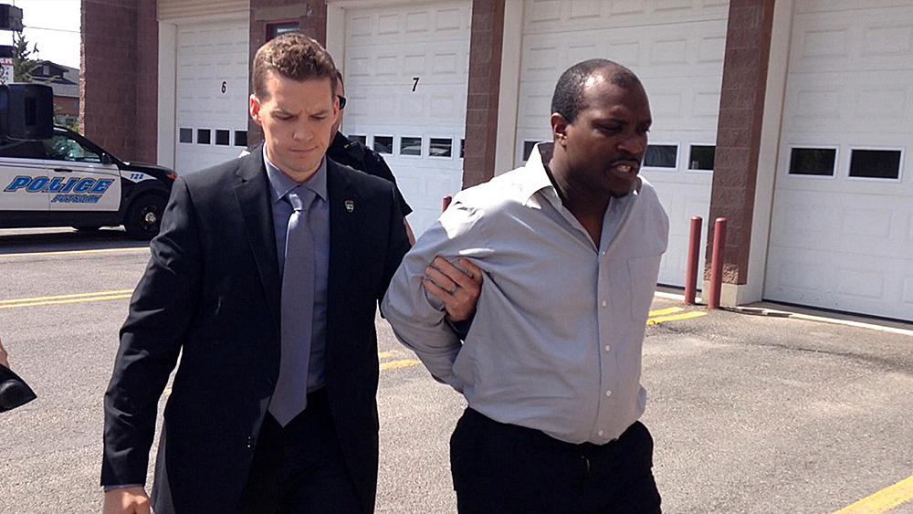
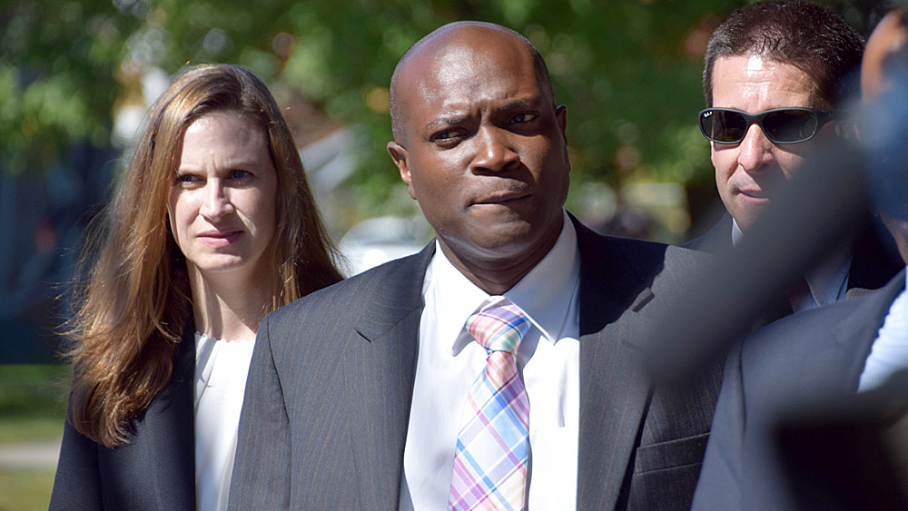
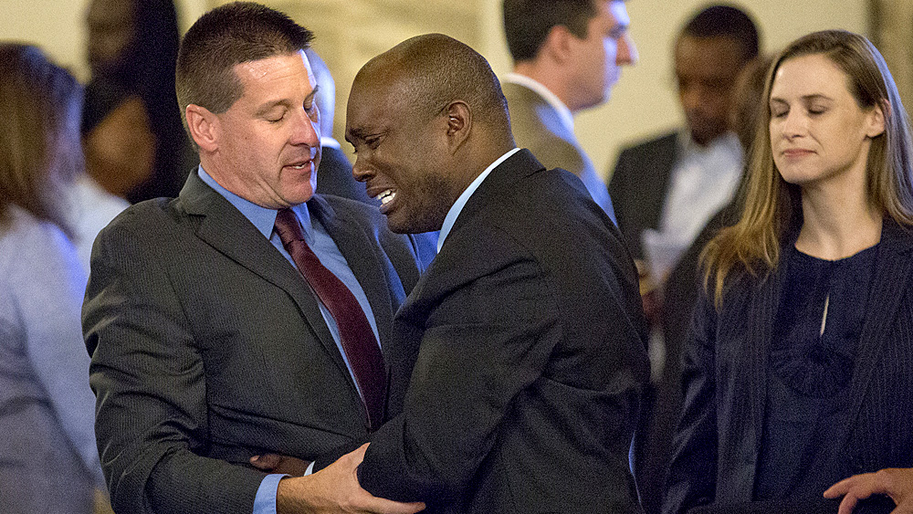

Potsdam, niewielkie miasteczko w hrabstwie St. Lawrence (Nowy York, USA), niedaleko granicy z Kanadą. 24 października 2011 roku zamordowany zostaje 12-letni chłopiec - Garrett Phillips. Nieudolne śledztwo lokalnej policji, uprzedzenia rasowe i głupota stanowej prokuratury sprawią, że 8 lat później, sprawa morderstwa Garretta ciągle pozostanie niewyjaśniona.

[Who Killed Garrett Phillips?](https://www.imdb.com/title/tt10532840/) to dwuczęściowy serial dokumentalny przygotowany dla HBO Documentaries - materiał próbujący nie tylko odpowiedzieć na tytułowe pytanie, ale również pokazujący kulisy rażąco zaniedbanego śledztwa i walki sądowej o dobre imię mężczyzny oskarżonego o zbrodnię jedynie na podstawie poszlakowych dowodów.

Autorem i reżyserem projektu jest [Liz Garbus](https://www.imdb.com/name/nm0305017/) - uznana dokumentalistka, dwukrotnie nominowana do Oscara, dwukrotna laureatka prestiżowych nagród Emmy ([Ghosts of Abu Ghraib](https://www.imdb.com/title/tt0912585/) i [What Happened, Miss Simone?](https://www.imdb.com/title/tt4284010/)).

Próbując nakreślić tło wydarzeń, jakie przyjdzie nam śledzić bądźmy jednak odrobinę obiektywni - Postdam to niewielkie, wiejskie miasteczko, którego populacja nie przekracza 16 tysięcy mieszkanców - to obszar zamieszkany w ogromnej większości przez białych, którzy styczność z przedstawicielami czarnoskórych mają w mediach lub też podczas pracy w wielu znajdujących się w okolicy ośrodkach penitencjarnych.

To potrafi wpłynąć na subiektywną opinię i stosowne uprzedzenia, których motyw jest niezwykle istotny dla tej sprawy.

Mamy popołudnie 24 października 2011 roku - Garrett Phillips wraca ze szkoły, co zostało uchwycone przez kilka miejskich kamer monitoringu. 15 minut później, sąsiadka chłopca mieszkająca w tym samym budynku, słyszy niepokojące odgłosy i wołanie o pomoc dochodzące zza ściany.

Zaniepokojona puka do drzwi, w odpowiedzi słysząc tylko dźwięk zamykanego zamka. Wezwana na miejsce policja znajduje w mieszkaniu pobitego i nieprzytomnego chłopca - dziecko umiera krótko po przewiezieniu do szpitala - oficjalny powód zgonu? Uduszenie. Co z mordercą? Nikt nie widział, by ten opuszczał mieszkanie.

Szokująca sprawa morderstwa młodego chłopca odbija się echem na społecznosci Postdam - zakrojone na szeroką skalę śledztwo szybko koncentruje się na jednej osobie - Oral 'Nick' Hillary, czarnoskóry mężczyzna, były partner matki ofiary, ale jednocześnie absolwent dobrej uczelni, zasłużony weteran wojenny, ceniony trener młodzieży - człowiek o nieposzlakowanej opinii. To bez znaczenia, bowiem wkrótce Nick zostaje oskarżony o mordestwo drugiego stopnia.

Who Killed Garrett Phillips? to naprawdę solidnie przygotowany serial dokumentalny - to materiał, który nie jest stronniczy, owszem pokazuje doskonale nieudolność lokalnych organów ścigania i administracji, ale też świetnie przedstawia lokalne społeczeństwo i motywy, którymi kierowali się zarówno mieszkańcy, praktycznie natychmiast wydając wyrok na oskarżonym, jak i policjanci prowadzący dochodzenie.

Ogromnę rolę w policyjno-prokuratorskiej farsie, jaką przyjdzie Wam zobaczyć, odegrały przede wszystkim uprzedzenia rasowe. To początek źle prowadzonego śledztwa, ignorowania istotnych wątków, ślepe brnięcie w uliczkę bez wyjścia. Dodajmy do tego wątki polityczne i wykorzystywanie ludzkiej tragedii celem budowania własnych karier politycznych - dostaniemy piękny obraz zepsutego do cna systemu sprawiedliwości w Stanach Zjednoczonych.

Liz Garbus reżyserując Who Killed Garrett Phillips wyjątkowo zadbała o rzetelne przedstawienie historii - budując napięcie od samego początku, koncentruje się mimo wszystko tylko i wyłącznie na faktach - dając pole do popisu i wypowiedzi nie tylko przedstawicielom lokalnych władz, ale i samym poszkodowanym w tej ciągle głośnej i nierozwiązanej po dziś sprawie.

Autorka, podobnie jak media - stawia przed widzami pytanie: kto zabił Garretta Phillipsa? Czy nierozwiązana sprawa morderstwa mogłaby potoczyć się inaczej? Skąd biorą się uprzedzenia rasowe? Dlaczego tak łatwo wydać nam osąd, nie mając przed oczami pełnego obrazu sytuacji? Dlaczego mimo wielu usilnych wkazówek policja ignorowała inne, bardzo prawdopodobne zresztą wątki?

Nie na wszystkie z tych pytań widzowie otrzymają odpowiedzi, ale serial bez wątpienia zachęci do samodzielnego wyciągania stosownych wniosków.

Who Killed Garrett Phillips to słodka-gorzka historia, w której nie znajdziemy szczęśliwego zakończenia. Sprawa śmierci 12-letniego Garreta ciągle pozostaje otwarta i nadal, nawet po 8 latach, rzuca cień na lokalną społeczność Postdam. Warto się z tą historią zapoznać, bo to naprawdę solidnie udokumentowana opowieść o ludzkiej tragedii.