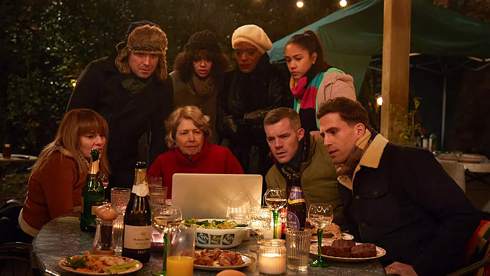
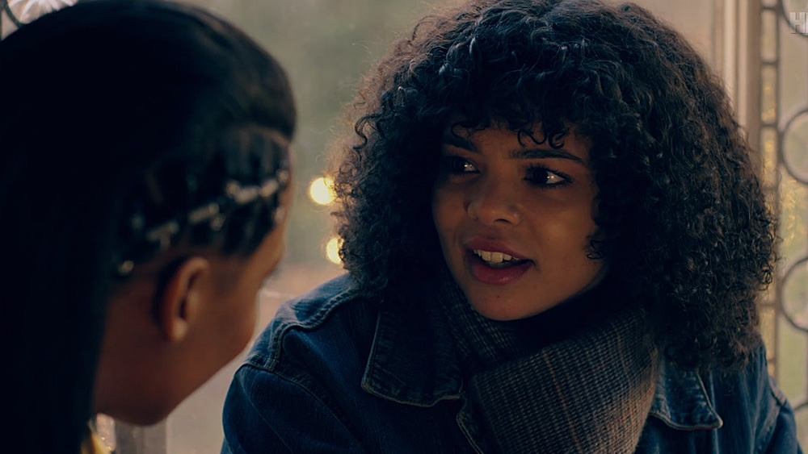
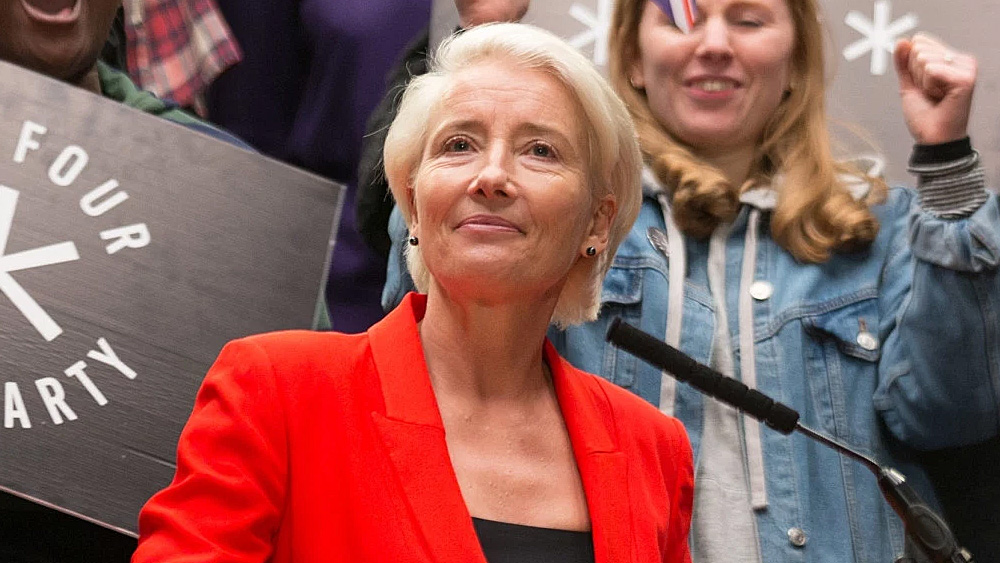
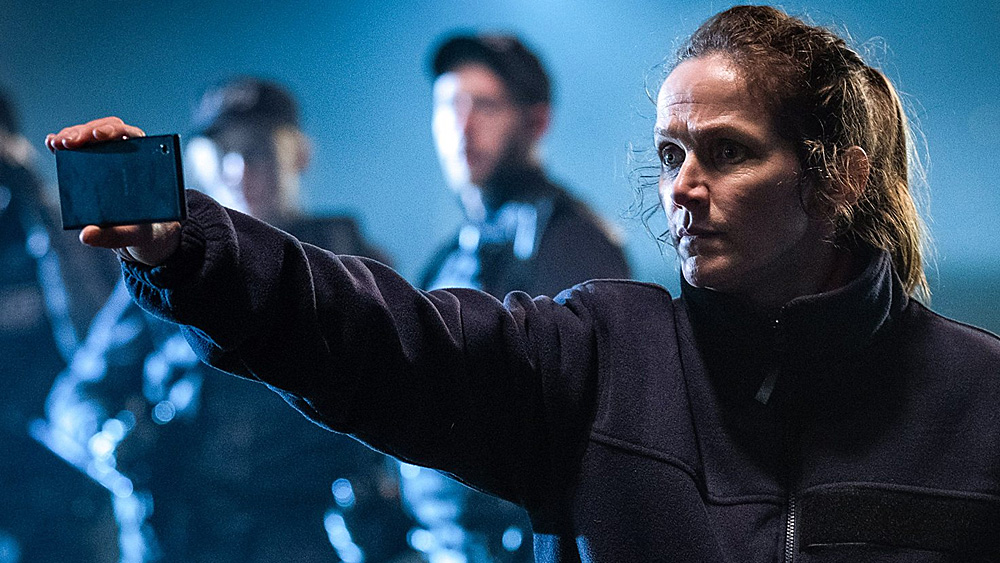

Pilotowy odcinek [Years and Years](https://www.imdb.com/title/tt8694364/) to jedno z najlepszych otwarć w historii współczesnych seriali telewizyjnych - [Russell T. Davies](https://www.imdb.com/name/nm0203961/) od pierwszych minut rzuca w stronę widza przerażającą wizję świata, przy której Black Mirror wygląda, jak niewinna zabawa w piaskownicy.

**To jeden z najbardziej niepokojących seriali, jakie dane mi było obrzejrzeć - przerażające i chwytające momentami za gardło widowisko**, które na podstawie przeszłej i obecnej sytuacji polityczno-gospodarczej świata pokazuje, jak może wyglądać przyszłość naszej cywilizacji. I próbuje przy tym odpowiedzieć na pytanie - dlaczego zmierzamy ku własnej zagładzie?

Years and Years to serial naprawdę niesamowicie dobry, produkcja która natychmiast mogłaby wstrzelić się w listę klasyków gatunku, będąc przykładem tego, jak dobry serial powinien być zrealizowany. Tak się jednak nie stanie, bo Russell przedobrzył i zrobił z tej produkcji materiał czysto propagandowy środowisk LGBTQ+, wykorzystując dodatkowo na potrzeby fabuły motyw uciemiężonych uchodźców. Poprawne politycznie... ale **mdłe i grubo przesadzone**.

Years and Years opowiada rozpoczynającą się w czasach obecnych, 15-letnią historię wielopokoleniowej, mieszkającej w Manchester (UK), rodziny Lyons, która próbuje przetrwać w dynamicznie zmieniającym się świecie. Co nie będzie należało do zadań prostych, bo niestabilna sytuacja gospodarczo-polityczna szukuje naszym bohaterom wiele, naprawdę różnorodnych niespodzianek.

A świat, w którym przyjdzie im i być może nam żyć jest wyjątkowo brutalny dla jednostki i nie aż tak oderwany od rzeczywistości - bowiem **wiele wykorzystanych w scenariuszu motywów odnosi się do aktualnych wydarzeń politycznych, czy też sytuacji, które miały miejsce w przeszłości** - kryzys ekonomiczny w Argentynie, czy też blackout w Wenezueli.

Russel T. Davies zadbał o to, by tworzona przez niego wizja świata wyglądała pow wieloma względami naturalnie, przez co właśnie jest tak bardzo przerażająca, a uczucie niepokoju rośnie z każdym kolejnym epizodem serialu.

W obsadzie Years and Years znajdziemy prawdziwą śmietankę aktorską - [Rory Kinnear](https://www.imdb.com/name/nm1239499/) (Stephen), [T'Nia Miller](https://www.imdb.com/name/nm2761963/) (Celeste), [Anne Reid](https://www.imdb.com/name/nm0717176/) (Muriel), [Ruth Madeley](https://www.imdb.com/name/nm3978118/) (Rosie), czy też [Emma Thompson](https://www.imdb.com/name/nm0000668/) (Vivienne Rook). To zespół cechujący się dobrym warsztatem aktorskim, co dodatkowo zostało uwypuklone przez sprawnie skonstruowany scenariusz.

Historię, która mimo swojej niezbyt oszałamiającej długości (cały serial zamyka się w sześciu godzinnych epizodach), daje postaciom spore pole do popisu. A nam, widzom, pozwala przelać autentyczne uczucia na bohaterów serialu - uczucia często odmienne, bowiem proces ewolucji poszczególnych osób został potraktowany z należytą uwagą. **Budowa postaci, rozwój ich charakteru na przestrzeni lat i ich motywacje, to z pewnością bardzo silna strona tego serialu**.

Ale wszystkie zachwyty zdają się blednąć poprzez niezrozumiałe dla mnie, nadmierne epatowanie przez twórcę popularnymi w dzisiejszych czasach motywami LGBTQ+ i tematem uchodźców. Years and Years to serial zrobiony pod publikę i pod konkretnę tezę, nie zostawiający pola do dyskusji.

Mamy tu wszystko - międzyrasowe małżeństwo, relacje męsko-męskie, relacje damsko-damskie, popularyzowanie zmiany płci, zachwianie własnej tożsamości, chłopca ubieranego, jak dziewczynka oraz wyraz zniesmaczenia na twarzy córki, która dowiaduje się, że jej ojciec zdradza matkę z BIAŁĄ kobietą. Tak, to jest istotne. **Russell T. Davies w ogóle się nie cacka, wali widzom tematyką LGBTQ+ prosto w twarz, w ogromnych ilościach, do porzygu**.

To jest naprawdę męczące, bo Years and Years staje się serialem, którego rolą jest lobbowanie i popularyzowanie ruchów mniejszościowych. Nie tak to powinno wyglądać, nie na tym powinno koncentrować się budowanie relacji poszczególnych postaci, nie to powinno być tematem przewodnim. Zabrakło umiaru, przez co momentami zabrakło też dobrego smaku.

Częściowo rozumiem zamysł, temat dotyczy nas wszystkich, jest istotny, jest przedmiotem publicznej dyskusji. Ale da się go przedstawić w sposób o wiele bardziej neutralny, bez nachalnego walenia tematyką prosto w naszą twarz, tym bardziej, że nie o tym jest ten serial. Zresztą nie muszę daleko szukać - Euphoria od HBO również epatuje wątkami LGBTQ+. Tyle, że Euphoria robi to w sposób przemyślany, naturalny. Mniejszość seksualna, odmienna orientacja jest tam częścią wykreowanego świata, czymś po prostu normalnym. Elementem ekosystemu świata, do tego elementem, który został przepięknie pokazany.

Szkoda, bo właśnie ta część Years and Years kładzie ogromny cień na cały serial. Serial, któremu naprawdę byłbym w stanie wystawić ocenę maksymalną. Gdyby tylko twórca znał umiar. Bo co za dużo, to i świnia nie chce...